# CollabIDE — System Design, User Flows & Low-Level Design

> **Assumption:** All components described are fully implemented and functional.

---

## Table of Contents

1. [End-to-End User Flow](#1-end-to-end-user-flow)
2. [High-Level System Architecture](#2-high-level-system-architecture)
3. [Component: Authentication & Entry Gate](#3-component-authentication--entry-gate)
4. [Component: Admin Dashboard & RBAC](#4-component-admin-dashboard--rbac)
5. [Component: Dashboard & Repository Browser](#5-component-dashboard--repository-browser)
6. [Component: Collaborative IDE](#6-component-collaborative-ide)
7. [Component: WebSocket Infrastructure](#7-component-websocket-infrastructure)
8. [Component: Multi-Layer Caching System](#8-component-multi-layer-caching-system)
9. [Component: In-File Chat System](#9-component-in-file-chat-system)
10. [Component: GitHub Webhook Pipeline](#10-component-github-webhook-pipeline)
11. [Database Schema (ERD)](#11-database-schema-erd)
12. [State Management Architecture](#12-state-management-architecture)
13. [Security Architecture](#13-security-architecture)
14. [Deployment Topology](#14-deployment-topology)

---

## 1. End-to-End User Flow

The complete journey from an unauthenticated visitor → collaborative editing session.

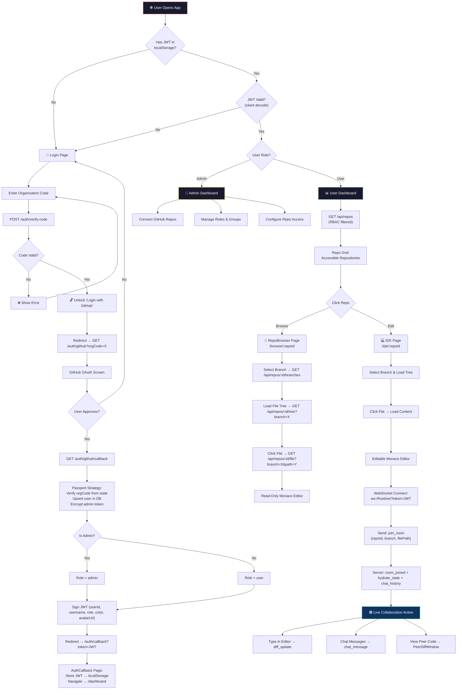
```mermaid
flowchart TD
    A["🌐 User Opens App"] --> B{"Has JWT in<br/>localStorage?"}
    B -- No --> C["📝 Login Page"]
    B -- Yes --> D{"JWT Valid?<br/>(client decode)"}
    D -- No --> C
    D -- Yes --> E{"User Role?"}

    C --> F["Enter Organization Code"]
    F --> G["POST /auth/verify-code"]
    G --> H{"Code Valid?"}
    H -- No --> I["❌ Show Error"]
    I --> F
    H -- Yes --> J["🔓 Unlock 'Login with GitHub'"]
    J --> K["Redirect → GET /auth/github?orgCode=X"]
    K --> L["GitHub OAuth Screen"]
    L --> M{"User Approves?"}
    M -- No --> C
    M -- Yes --> N["GET /auth/github/callback"]
    N --> O["Passport Strategy:<br/>Verify orgCode from state<br/>Upsert user in DB<br/>Encrypt admin token"]
    O --> P{"Is Admin?"}
    P -- Yes --> Q["Role = admin"]
    P -- No --> R["Role = user"]
    Q --> S["Sign JWT (userId, username, role, color, avatarUrl)"]
    R --> S
    S --> T["Redirect → /auth/callback?token=JWT"]
    T --> U["AuthCallback Page:<br/>Store JWT → localStorage<br/>Navigate → /dashboard"]

    E -- Admin --> V["🔧 Admin Dashboard"]
    E -- User --> W["📊 User Dashboard"]

    W --> X["GET /api/repos<br/>(RBAC filtered)"]
    X --> Y["Repo Grid:<br/>Accessible Repositories"]
    Y --> Z{"Click Repo"}
    Z -- Browse --> AA["📂 RepoBrowser Page<br/>/browse/:repoId"]
    Z -- Edit --> AB["💻 IDE Page<br/>/ide/:repoId"]

    AA --> AC["Select Branch → GET /api/repos/:id/branches"]
    AC --> AD["Load File Tree → GET /api/repos/:id/tree?branch=X"]
    AD --> AE["Click File → GET /api/repos/:id/file?branch=X&path=Y"]
    AE --> AF["Read-Only Monaco Editor"]

    AB --> AG["Select Branch & Load Tree"]
    AG --> AH["Click File → Load Content"]
    AH --> AI["Editable Monaco Editor"]
    AI --> AJ["WebSocket Connect:<br/>ws://host/ws?token=JWT"]
    AJ --> AK["Send: join_room<br/>{repoId, branch, filePath}"]
    AK --> AL["Server: room_joined + hydrate_state + chat_history"]
    AL --> AM["🟢 Live Collaboration Active"]

    AM --> AN["Type in Editor → diff_update"]
    AM --> AO["Chat Messages → chat_message"]
    AM --> AP["View Peer Code → PeerDiffWindow"]

    V --> AQ["Connect GitHub Repos"]
    V --> AR["Manage Roles & Groups"]
    V --> AS["Configure Repo Access"]

    style A fill:#1a1a2e,stroke:#e94560,color:#fff
    style AM fill:#0f3460,stroke:#16c79a,color:#fff
    style V fill:#1a1a2e,stroke:#ffd700,color:#fff
    style W fill:#1a1a2e,stroke:#4ecdc4,color:#fff
```

---

## 2. High-Level System Architecture

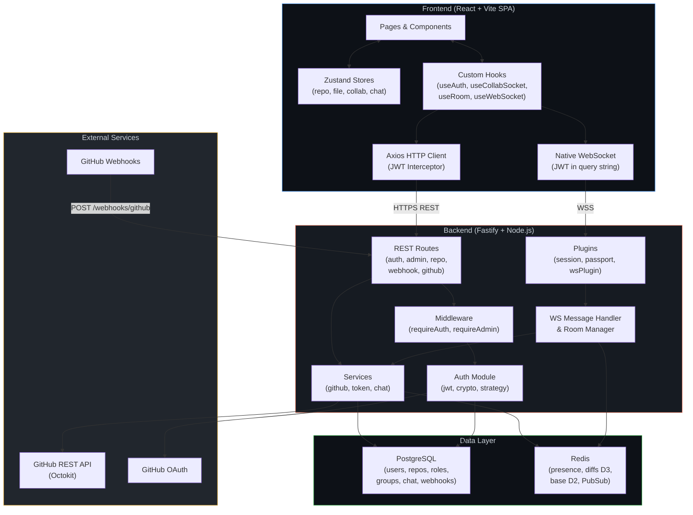
```mermaid
graph TB
    subgraph CLIENT["Frontend (React + Vite SPA)"]
        direction TB
        UI["Pages & Components"]
        STORES["Zustand Stores<br/>(repo, file, collab, chat)"]
        HOOKS["Custom Hooks<br/>(useAuth, useCollabSocket,<br/>useRoom, useWebSocket)"]
        API_CLIENT["Axios HTTP Client<br/>(JWT Interceptor)"]
        WS_CLIENT["Native WebSocket<br/>(JWT in query string)"]
    end

    subgraph SERVER["Backend (Fastify + Node.js)"]
        direction TB
        ROUTES["REST Routes<br/>(auth, admin, repo,<br/>webhook, github)"]
        MW["Middleware<br/>(requireAuth, requireAdmin)"]
        PLUGINS["Plugins<br/>(session, passport, wsPlugin)"]
        WS_HANDLER["WS Message Handler<br/>& Room Manager"]
        SERVICES["Services<br/>(github, token, chat)"]
        AUTH["Auth Module<br/>(jwt, crypto, strategy)"]
    end

    subgraph DATA["Data Layer"]
        direction LR
        PG["PostgreSQL<br/>(users, repos, roles,<br/>groups, chat, webhooks)"]
        REDIS["Redis<br/>(presence, diffs D3,<br/>base D2, PubSub)"]
    end

    subgraph EXTERNAL["External Services"]
        GITHUB_API["GitHub REST API<br/>(Octokit)"]
        GITHUB_OAUTH["GitHub OAuth"]
        GITHUB_WH["GitHub Webhooks"]
    end

    UI <--> STORES
    UI <--> HOOKS
    HOOKS --> API_CLIENT
    HOOKS --> WS_CLIENT

    API_CLIENT -->|"HTTPS REST"| ROUTES
    WS_CLIENT -->|"WSS"| PLUGINS

    ROUTES --> MW
    MW --> AUTH
    ROUTES --> SERVICES

    PLUGINS --> WS_HANDLER
    WS_HANDLER --> SERVICES

    SERVICES --> PG
    SERVICES --> REDIS
    WS_HANDLER --> REDIS
    SERVICES --> GITHUB_API

    AUTH --> PG
    AUTH --> GITHUB_OAUTH

    GITHUB_WH -->|"POST /webhooks/github"| ROUTES

    style CLIENT fill:#0d1117,stroke:#58a6ff,color:#c9d1d9
    style SERVER fill:#161b22,stroke:#f78166,color:#c9d1d9
    style DATA fill:#0d1117,stroke:#3fb950,color:#c9d1d9
    style EXTERNAL fill:#21262d,stroke:#d29922,color:#c9d1d9
```

---

## 3. Component: Authentication & Entry Gate

### 3.1 System Description

The authentication system implements a **two-phase entry gate**:

1. **Phase 1 — Organization Code Verification:** Before any OAuth flow begins, the user must prove knowledge of a shared organization secret. The plaintext code on the client is compared against a bcrypt hash stored in the `organizations` table. This prevents unauthorized users from even reaching the GitHub login.

2. **Phase 2 — GitHub OAuth 2.0:** Once the org code is verified, the user is redirected to GitHub's OAuth consent screen. The org code is embedded in the OAuth `state` parameter so it can be re-verified server-side during the callback (defense against replay attacks). After GitHub authorization, the Passport strategy:
   - Determines if the user is the designated admin (via `ADMIN_GITHUB_USERNAME` env var)
   - Encrypts the admin's GitHub access token with AES-256-CBC for later API proxying
   - Upserts the user record in PostgreSQL
   - Assigns a deterministic round-robin color for presence indicators
   - Signs and returns a JWT for stateless authentication

**Key Files:**
| File | Purpose |
|------|---------|
| `server/src/auth/github.strategy.ts` | Passport strategy with org code verification + user upsert |
| `server/src/auth/jwt.ts` | JWT sign/verify using `jsonwebtoken` |
| `server/src/auth/crypto.ts` | AES-256-CBC encrypt/decrypt for tokens & chat |
| `server/src/routes/auth.routes.ts` | REST endpoints: verify-code, github, callback, logout |
| `server/src/middleware/requireAuth.ts` | JWT extraction from `Authorization: Bearer` header |
| `server/src/middleware/requireAdmin.ts` | Chains auth + role check |
| `client/src/pages/Login.tsx` | Org code input + OAuth trigger UI |
| `client/src/pages/AuthCallback.tsx` | Token capture from URL → localStorage |
| `client/src/hooks/useAuth.ts` | Token helpers, client-side JWT decode, logout |

### 3.2 LLD — Authentication Sequence

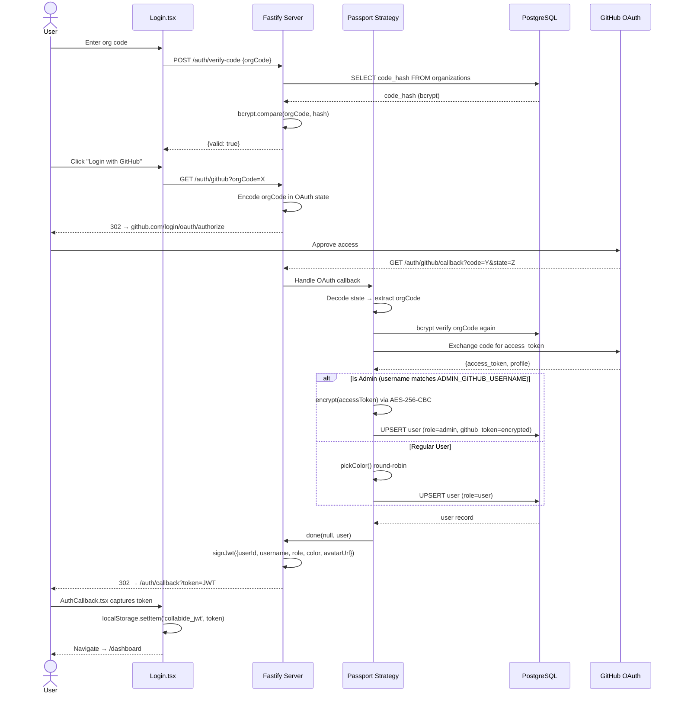
```mermaid
sequenceDiagram
    actor User
    participant Login as Login.tsx
    participant Server as Fastify Server
    participant Strategy as Passport Strategy
    participant DB as PostgreSQL
    participant GitHub as GitHub OAuth

    User->>Login: Enter org code
    Login->>Server: POST /auth/verify-code {orgCode}
    Server->>DB: SELECT code_hash FROM organizations
    DB-->>Server: code_hash (bcrypt)
    Server->>Server: bcrypt.compare(orgCode, hash)
    Server-->>Login: {valid: true}

    User->>Login: Click "Login with GitHub"
    Login->>Server: GET /auth/github?orgCode=X
    Server->>Server: Encode orgCode in OAuth state
    Server-->>User: 302 → github.com/login/oauth/authorize

    User->>GitHub: Approve access
    GitHub-->>Server: GET /auth/github/callback?code=Y&state=Z

    Server->>Strategy: Handle OAuth callback
    Strategy->>Strategy: Decode state → extract orgCode
    Strategy->>DB: bcrypt verify orgCode again
    Strategy->>GitHub: Exchange code for access_token
    GitHub-->>Strategy: {access_token, profile}

    alt Is Admin (username matches ADMIN_GITHUB_USERNAME)
        Strategy->>Strategy: encrypt(accessToken) via AES-256-CBC
        Strategy->>DB: UPSERT user (role=admin, github_token=encrypted)
    else Regular User
        Strategy->>Strategy: pickColor() round-robin
        Strategy->>DB: UPSERT user (role=user)
    end

    DB-->>Strategy: user record
    Strategy->>Server: done(null, user)
    Server->>Server: signJwt({userId, username, role, color, avatarUrl})
    Server-->>User: 302 → /auth/callback?token=JWT

    User->>Login: AuthCallback.tsx captures token
    Login->>Login: localStorage.setItem('collabide_jwt', token)
    Login-->>User: Navigate → /dashboard
```

### 3.3 LLD — JWT Payload & Middleware Chain

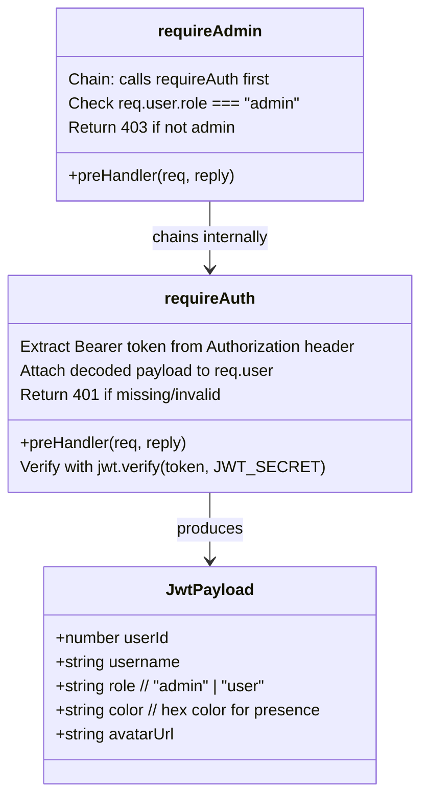
```mermaid
classDiagram
    class JwtPayload {
        +number userId
        +string username
        +string role    // "admin" | "user"
        +string color   // hex color for presence
        +string avatarUrl
    }

    class requireAuth {
        +preHandler(req, reply)
        Extract Bearer token from Authorization header
        Verify with jwt.verify(token, JWT_SECRET)
        Attach decoded payload to req.user
        Return 401 if missing/invalid
    }

    class requireAdmin {
        +preHandler(req, reply)
        Chain: calls requireAuth first
        Check req.user.role === "admin"
        Return 403 if not admin
    }

    requireAdmin --> requireAuth : chains internally
    requireAuth --> JwtPayload : produces
```

---

## 4. Component: Admin Dashboard & RBAC

### 4.1 System Description

The Admin Dashboard (`AdminDashboard.tsx`) is a restricted page that provides three management domains:

1. **Repository Connection:** The admin can browse their personal GitHub repos (via their stored encrypted token), connect them to CollabIDE, and disconnect them. Connected repos are persisted in `connected_repos` with GitHub metadata.

2. **Role & Group Management:** Create/delete custom roles and groups. Assign users to roles (via `user_roles`) and groups (via `user_groups`). Predefined roles (`admin`, `user`) cannot be deleted.

3. **Repository Access Control:** Each connected repo has a `visibility` field:
   - `'all'` — accessible to every authenticated user
   - `'restricted'` — only users whose roles OR groups match entries in `repo_access` can access

The RBAC evaluation is performed in `canAccess()` in `repo.routes.ts` — a SQL query that joins `repo_access` with `user_roles` and `user_groups` to check intersection.

### 4.2 LLD — RBAC Entity Relationships

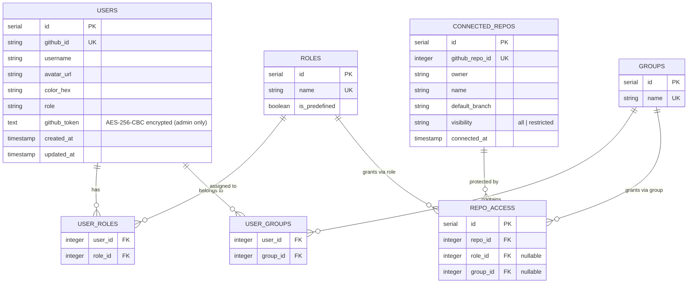
```mermaid
erDiagram
    USERS ||--o{ USER_ROLES : "has"
    USERS ||--o{ USER_GROUPS : "belongs to"
    ROLES ||--o{ USER_ROLES : "assigned to"
    GROUPS ||--o{ USER_GROUPS : "contains"
    CONNECTED_REPOS ||--o{ REPO_ACCESS : "protected by"
    ROLES ||--o{ REPO_ACCESS : "grants via role"
    GROUPS ||--o{ REPO_ACCESS : "grants via group"

    USERS {
        serial id PK
        string github_id UK
        string username
        string avatar_url
        string color_hex
        string role
        text github_token "AES-256-CBC encrypted (admin only)"
        timestamp created_at
        timestamp updated_at
    }

    ROLES {
        serial id PK
        string name UK
        boolean is_predefined
    }

    GROUPS {
        serial id PK
        string name UK
    }

    USER_ROLES {
        integer user_id FK
        integer role_id FK
    }

    USER_GROUPS {
        integer user_id FK
        integer group_id FK
    }

    CONNECTED_REPOS {
        serial id PK
        integer github_repo_id UK
        string owner
        string name
        string default_branch
        string visibility "all | restricted"
        timestamp connected_at
    }

    REPO_ACCESS {
        serial id PK
        integer repo_id FK
        integer role_id FK "nullable"
        integer group_id FK "nullable"
    }
```

### 4.3 LLD — Access Control Decision Flow

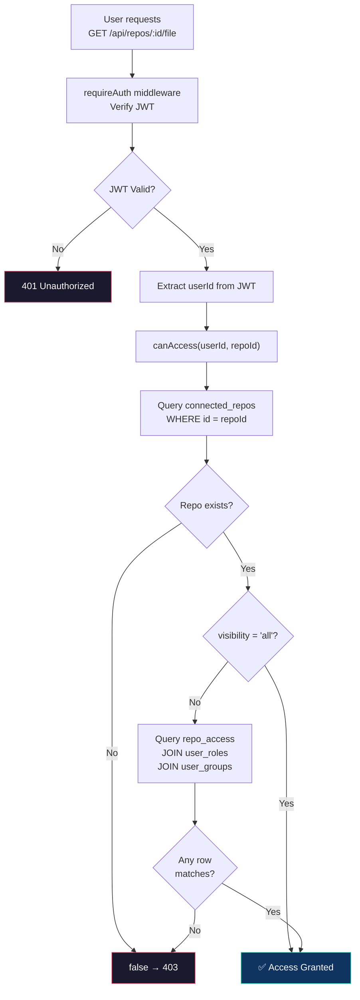
```mermaid
flowchart TD
    A["User requests<br/>GET /api/repos/:id/file"] --> B["requireAuth middleware<br/>Verify JWT"]
    B --> C{"JWT Valid?"}
    C -- No --> D["401 Unauthorized"]
    C -- Yes --> E["Extract userId from JWT"]
    E --> F["canAccess(userId, repoId)"]

    F --> G["Query connected_repos<br/>WHERE id = repoId"]
    G --> H{"Repo exists?"}
    H -- No --> I["false → 403"]
    H -- Yes --> J{"visibility = 'all'?"}
    J -- Yes --> K["✅ Access Granted"]
    J -- No --> L["Query repo_access<br/>JOIN user_roles<br/>JOIN user_groups"]
    L --> M{"Any row<br/>matches?"}
    M -- Yes --> K
    M -- No --> I

    style K fill:#0f3460,stroke:#16c79a,color:#fff
    style D fill:#1a1a2e,stroke:#e94560,color:#fff
    style I fill:#1a1a2e,stroke:#e94560,color:#fff
```

### 4.4 LLD — Admin API Endpoints

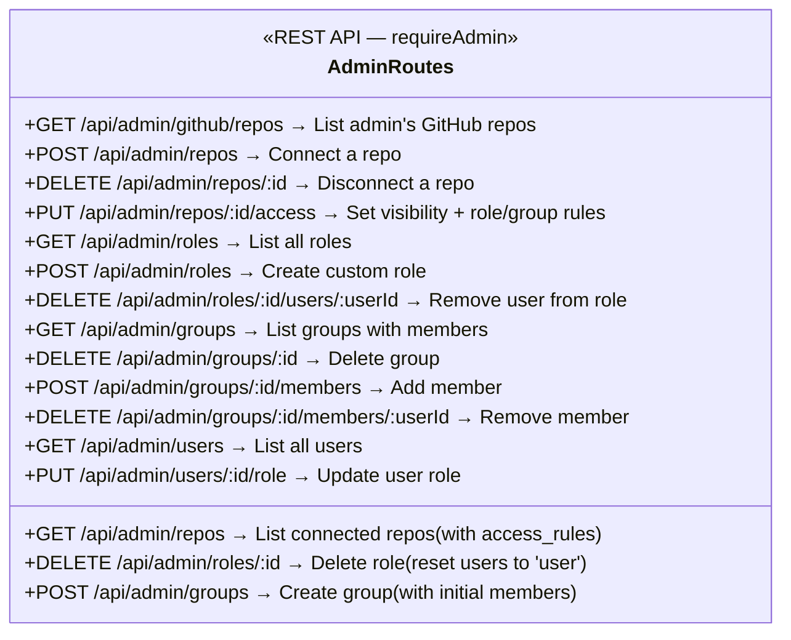
```mermaid
classDiagram
    class AdminRoutes {
        <<REST API — requireAdmin>>
        +GET /api/admin/github/repos → List admin's GitHub repos
        +GET /api/admin/repos → List connected repos (with access_rules)
        +POST /api/admin/repos → Connect a repo
        +DELETE /api/admin/repos/:id → Disconnect a repo
        +PUT /api/admin/repos/:id/access → Set visibility + role/group rules
        +GET /api/admin/roles → List all roles
        +POST /api/admin/roles → Create custom role
        +DELETE /api/admin/roles/:id → Delete role (reset users to 'user')
        +DELETE /api/admin/roles/:id/users/:userId → Remove user from role
        +GET /api/admin/groups → List groups with members
        +POST /api/admin/groups → Create group (with initial members)
        +DELETE /api/admin/groups/:id → Delete group
        +POST /api/admin/groups/:id/members → Add member
        +DELETE /api/admin/groups/:id/members/:userId → Remove member
        +GET /api/admin/users → List all users
        +PUT /api/admin/users/:id/role → Update user role
    }
```

---

## 5. Component: Dashboard & Repository Browser

### 5.1 System Description

**Dashboard (`Dashboard.tsx`):** The standard user entry point. Calls `GET /api/repos` which returns repos filtered by RBAC. Admin sees all connected repos; regular users see repos with `visibility='all'` or repos matching their roles/groups. Results are rendered as a clickable repo grid.

**RepoBrowser (`RepoBrowser.tsx`):** A read-only IDE-like interface:
- **Branch Selector:** Fetches branches via `GET /api/repos/:id/branches`
- **File Tree:** Recursive `TreeView` DOM component built from `GET /api/repos/:id/tree?branch=X`
- **Monaco Editor:** Read-only `@monaco-editor/react` instance displaying file content from `GET /api/repos/:id/file?branch=X&path=Y`

### 5.2 LLD — Repository Data Flow

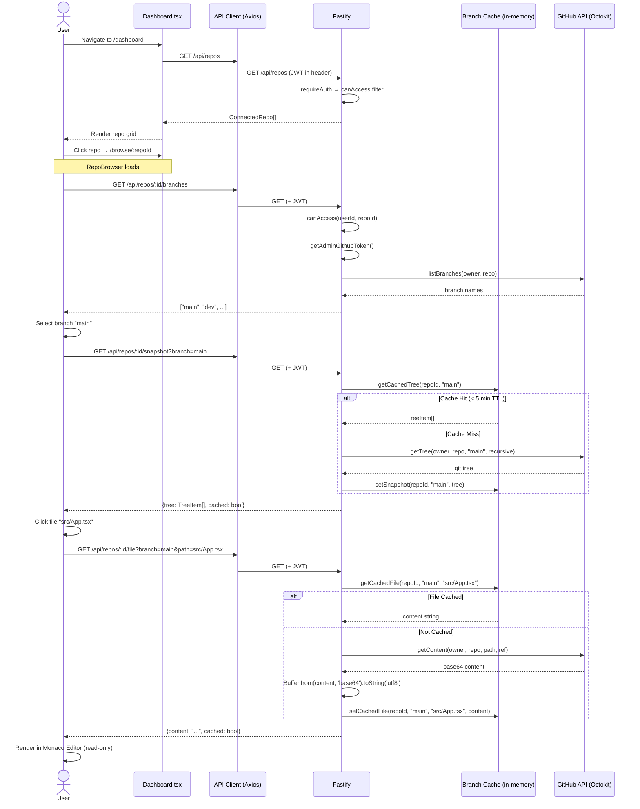
```mermaid
sequenceDiagram
    actor User
    participant Dashboard as Dashboard.tsx
    participant Axios as API Client (Axios)
    participant Server as Fastify
    participant Cache as Branch Cache (in-memory)
    participant Octokit as GitHub API (Octokit)

    User->>Dashboard: Navigate to /dashboard
    Dashboard->>Axios: GET /api/repos
    Axios->>Server: GET /api/repos (JWT in header)
    Server->>Server: requireAuth → canAccess filter
    Server-->>Dashboard: ConnectedRepo[]
    Dashboard-->>User: Render repo grid

    User->>Dashboard: Click repo → /browse/:repoId
    Note over User,Dashboard: RepoBrowser loads

    User->>Axios: GET /api/repos/:id/branches
    Axios->>Server: GET (+ JWT)
    Server->>Server: canAccess(userId, repoId)
    Server->>Server: getAdminGithubToken()
    Server->>Octokit: listBranches(owner, repo)
    Octokit-->>Server: branch names
    Server-->>User: ["main", "dev", ...]

    User->>User: Select branch "main"

    User->>Axios: GET /api/repos/:id/snapshot?branch=main
    Axios->>Server: GET (+ JWT)
    Server->>Cache: getCachedTree(repoId, "main")
    alt Cache Hit (< 5 min TTL)
        Cache-->>Server: TreeItem[]
    else Cache Miss
        Server->>Octokit: getTree(owner, repo, "main", recursive)
        Octokit-->>Server: git tree
        Server->>Cache: setSnapshot(repoId, "main", tree)
    end
    Server-->>User: {tree: TreeItem[], cached: bool}

    User->>User: Click file "src/App.tsx"

    User->>Axios: GET /api/repos/:id/file?branch=main&path=src/App.tsx
    Axios->>Server: GET (+ JWT)
    Server->>Cache: getCachedFile(repoId, "main", "src/App.tsx")
    alt File Cached
        Cache-->>Server: content string
    else Not Cached
        Server->>Octokit: getContent(owner, repo, path, ref)
        Octokit-->>Server: base64 content
        Server->>Server: Buffer.from(content, 'base64').toString('utf8')
        Server->>Cache: setCachedFile(repoId, "main", "src/App.tsx", content)
    end
    Server-->>User: {content: "...", cached: bool}
    User->>User: Render in Monaco Editor (read-only)
```

---

## 6. Component: Collaborative IDE

### 6.1 System Description

The IDE page (`IDE.tsx`) is the core collaboration surface. It renders a **3-column grid layout**:

| Column | Width | Content |
|--------|-------|---------|
| Left | 280px | File tree (BranchSelector + recursive TreeView) |
| Center | 1fr | Collaborative Monaco Editor + PresenceBar + ChatPanel overlay |
| Right | 260px | WebhookLog (recent push events) |

**Key behaviors:**
- **File Selection:** Loading a file fetches content from the server (with caching), opens it in the editable Monaco editor, and triggers a WebSocket `join_room` for real-time collaboration.
- **Real-Time Editing:** Every keystroke generates Monaco `IModelContentChange` events → serialized as `DiffPatch[]` → sent as `diff_update` via WebSocket → relayed to all peers via Redis PubSub.
- **Presence Indicators:** The `PresenceBar` shows colored avatars of peers currently in the same file room. Colors are deterministic per-username.
- **Peer Document Viewing:** The `PeerDiffWindow` allows viewing a read-only synchronized copy of any peer's current document state in a split-pane layout.
- **Chat Overlay:** The `ChatPanel` is a collapsible right-edge overlay for file-scoped real-time chat.

### 6.2 LLD — IDE Component Architecture

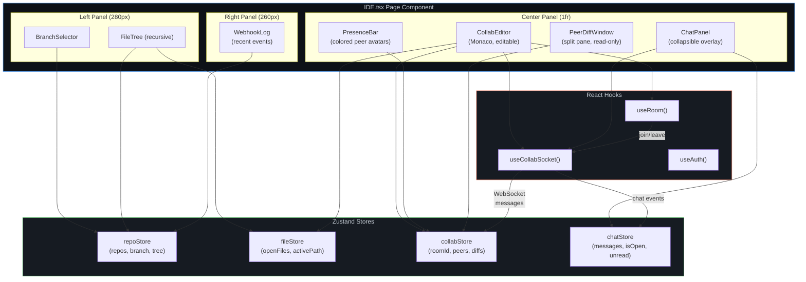
```mermaid
graph TB
    subgraph IDE_PAGE["IDE.tsx Page Component"]
        direction TB

        subgraph COL1["Left Panel (280px)"]
            BS["BranchSelector"]
            FT["FileTree (recursive)"]
        end

        subgraph COL2["Center Panel (1fr)"]
            PB["PresenceBar<br/>(colored peer avatars)"]
            CE["CollabEditor<br/>(Monaco, editable)"]
            PDW["PeerDiffWindow<br/>(split pane, read-only)"]
            CP["ChatPanel<br/>(collapsible overlay)"]
        end

        subgraph COL3["Right Panel (260px)"]
            WL["WebhookLog<br/>(recent events)"]
        end
    end

    subgraph HOOKS["React Hooks"]
        H1["useCollabSocket()"]
        H2["useRoom()"]
        H3["useAuth()"]
    end

    subgraph STORES["Zustand Stores"]
        RS["repoStore<br/>(repos, branch, tree)"]
        FS["fileStore<br/>(openFiles, activePath)"]
        CS["collabStore<br/>(roomId, peers, diffs)"]
        CHS["chatStore<br/>(messages, isOpen, unread)"]
    end

    BS --> RS
    FT --> RS
    FT --> FS
    CE --> FS
    CE --> CS
    CE --> H1
    CE --> H2
    PB --> CS
    PDW --> CS
    CP --> CHS
    CP --> H1
    WL --> RS

    H1 -->|"WebSocket<br/>messages"| CS
    H1 -->|"chat events"| CHS
    H2 -->|"join/leave"| H1

    style IDE_PAGE fill:#0d1117,stroke:#58a6ff,color:#c9d1d9
    style HOOKS fill:#161b22,stroke:#f78166,color:#c9d1d9
    style STORES fill:#161b22,stroke:#3fb950,color:#c9d1d9
```

### 6.3 LLD — Collaborative Editing Data Flow

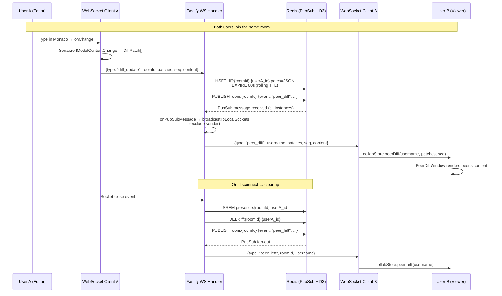
```mermaid
sequenceDiagram
    participant UserA as User A (Editor)
    participant WS_A as WebSocket Client A
    participant Server as Fastify WS Handler
    participant Redis as Redis (PubSub + D3)
    participant WS_B as WebSocket Client B
    participant UserB as User B (Viewer)

    Note over UserA,UserB: Both users join the same room

    UserA->>WS_A: Type in Monaco → onChange
    WS_A->>WS_A: Serialize IModelContentChange → DiffPatch[]
    WS_A->>Server: {type: "diff_update", roomId, patches, seq, content}

    Server->>Redis: HSET diff:{roomId}:{userA_id} patch=JSON<br/>EXPIRE 60s (rolling TTL)
    Server->>Redis: PUBLISH room:{roomId} {event: "peer_diff", ...}

    Redis-->>Server: PubSub message received (all instances)
    Server->>Server: onPubSubMessage → broadcastToLocalSockets<br/>(exclude sender)
    Server->>WS_B: {type: "peer_diff", username, patches, seq, content}

    WS_B->>UserB: collabStore.peerDiff(username, patches, seq)
    UserB->>UserB: PeerDiffWindow renders peer's content

    Note over Server,Redis: On disconnect → cleanup

    UserA->>Server: Socket close event
    Server->>Redis: SREM presence:{roomId} userA_id
    Server->>Redis: DEL diff:{roomId}:{userA_id}
    Server->>Redis: PUBLISH room:{roomId} {event: "peer_left", ...}
    Redis-->>Server: PubSub fan-out
    Server->>WS_B: {type: "peer_left", roomId, username}
    WS_B->>UserB: collabStore.peerLeft(username)
```

---

## 7. Component: WebSocket Infrastructure

### 7.1 System Description

The WebSocket layer is built on `@fastify/websocket` and provides:

1. **Connection Authentication:** JWT is passed as a `?token=` query parameter during the WebSocket upgrade handshake. Invalid tokens result in immediate `close(4401)`.

2. **Room Management:** Rooms are keyed by `{repoId}:{branch}:{filePath}`. The `roomManager.ts` tracks local sockets per room AND coordinates with Redis for cross-instance awareness.

3. **Message Protocol:** A strictly typed bidirectional protocol (`ClientMessage` ↔ `ServerMessage`) handles 6 client message types and 10 server message types.

4. **Cross-Instance Fan-Out:** Redis PubSub ensures that when multiple Fastify instances run behind a load balancer, all peers in a room receive updates regardless of which instance they're connected to.

### 7.2 LLD — WebSocket Message Protocol

```mermaid
classDiagram
    class ClientMessage {
        <<union type>>
    }
    class JoinRoom {
        +type: "join_room"
        +repoId: string
        +branch: string
        +filePath: string
    }
    class LeaveRoom {
        +type: "leave_room"
        +roomId: string
    }
    class DiffUpdate {
        +type: "diff_update"
        +roomId: string
        +patches: DiffPatch[]
        +seq: number
        +content?: string
    }
    class ChatMessage_C {
        +type: "chat_message"
        +roomId: string
        +text: string
    }
    class ChatLoadOlder {
        +type: "chat_load_older"
        +roomId: string
        +beforeId: number
    }
    class ChatDelete_C {
        +type: "chat_delete"
        +roomId: string
        +messageId: number
    }

    ClientMessage <|-- JoinRoom
    ClientMessage <|-- LeaveRoom
    ClientMessage <|-- DiffUpdate
    ClientMessage <|-- ChatMessage_C
    ClientMessage <|-- ChatLoadOlder
    ClientMessage <|-- ChatDelete_C

    class ServerMessage {
        <<union type>>
    }
    class RoomJoined {
        +type: "room_joined"
        +roomId: string
        +peers: PeerInfo[]
    }
    class PeerJoined {
        +type: "peer_joined"
        +roomId: string
        +username: string
        +avatarUrl: string?
    }
    class PeerLeft {
        +type: "peer_left"
        +roomId: string
        +username: string
    }
    class PeerDiff {
        +type: "peer_diff"
        +roomId: string
        +username: string
        +patches: DiffPatch[]
        +seq: number
        +content?: string
    }
    class HydrateState {
        +type: "hydrate_state"
        +roomId: string
        +base: string?
        +diffs: UserDiff[]
    }
    class RemotePush {
        +type: "remote_push"
        +roomId: string
        +pushedBy: string
        +branch: string
        +changedFiles: string[]
        +commitSha: string
    }
    class ChatBroadcast {
        +type: "chat_broadcast"
        +roomId: string
        +messageId: number
        +userId: number
        +username: string
        +text: string
        +timestamp: number
    }
    class ChatHistory {
        +type: "chat_history"
        +roomId: string
        +messages: ChatEntry[]
    }
    class ChatOlderHistory {
        +type: "chat_older_history"
        +roomId: string
        +messages: ChatEntry[]
        +hasMore: boolean
    }
    class ChatDeleted {
        +type: "chat_deleted"
        +roomId: string
        +messageId: number
        +deletedBy: number
    }

    ServerMessage <|-- RoomJoined
    ServerMessage <|-- PeerJoined
    ServerMessage <|-- PeerLeft
    ServerMessage <|-- PeerDiff
    ServerMessage <|-- HydrateState
    ServerMessage <|-- RemotePush
    ServerMessage <|-- ChatBroadcast
    ServerMessage <|-- ChatHistory
    ServerMessage <|-- ChatOlderHistory
    ServerMessage <|-- ChatDeleted

    class DiffPatch {
        +range: Range
        +text: string
        +rangeLength: number
    }
    class Range {
        +startLineNumber: number
        +startColumn: number
        +endLineNumber: number
        +endColumn: number
    }
    DiffPatch --> Range
```

### 7.3 LLD — Room Join Hydration Sequence

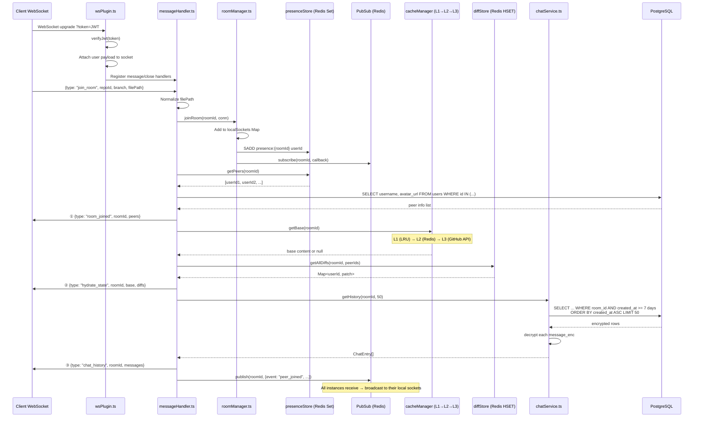
```mermaid
sequenceDiagram
    participant Client as Client WebSocket
    participant Plugin as wsPlugin.ts
    participant Handler as messageHandler.ts
    participant RoomMgr as roomManager.ts
    participant Presence as presenceStore (Redis Set)
    participant PubSub as PubSub (Redis)
    participant BaseCache as cacheManager (L1→L2→L3)
    participant DiffStore as diffStore (Redis HSET)
    participant ChatSvc as chatService.ts
    participant DB as PostgreSQL

    Client->>Plugin: WebSocket upgrade ?token=JWT
    Plugin->>Plugin: verifyJwt(token)
    Plugin->>Plugin: Attach user payload to socket
    Plugin->>Handler: Register message/close handlers

    Client->>Handler: {type: "join_room", repoId, branch, filePath}
    Handler->>Handler: Normalize filePath
    Handler->>RoomMgr: joinRoom(roomId, conn)
    RoomMgr->>RoomMgr: Add to localSockets Map
    RoomMgr->>Presence: SADD presence:{roomId} userId
    RoomMgr->>PubSub: subscribe(roomId, callback)

    Handler->>Presence: getPeers(roomId)
    Presence-->>Handler: [userId1, userId2, ...]
    Handler->>DB: SELECT username, avatar_url FROM users WHERE id IN (...)
    DB-->>Handler: peer info list

    Handler->>Client: ① {type: "room_joined", roomId, peers}

    Handler->>BaseCache: getBase(roomId)
    Note over BaseCache: L1 (LRU) → L2 (Redis) → L3 (GitHub API)
    BaseCache-->>Handler: base content or null

    Handler->>DiffStore: getAllDiffs(roomId, peerIds)
    DiffStore-->>Handler: Map<userId, patch>

    Handler->>Client: ② {type: "hydrate_state", roomId, base, diffs}

    Handler->>ChatSvc: getHistory(roomId, 50)
    ChatSvc->>DB: SELECT ... WHERE room_id AND created_at >= 7 days<br/>ORDER BY created_at ASC LIMIT 50
    DB-->>ChatSvc: encrypted rows
    ChatSvc->>ChatSvc: decrypt each message_enc
    ChatSvc-->>Handler: ChatEntry[]

    Handler->>Client: ③ {type: "chat_history", roomId, messages}

    Handler->>PubSub: publish(roomId, {event: "peer_joined", ...})
    Note over PubSub: All instances receive → broadcast to their local sockets
```

### 7.4 LLD — Room Manager Architecture

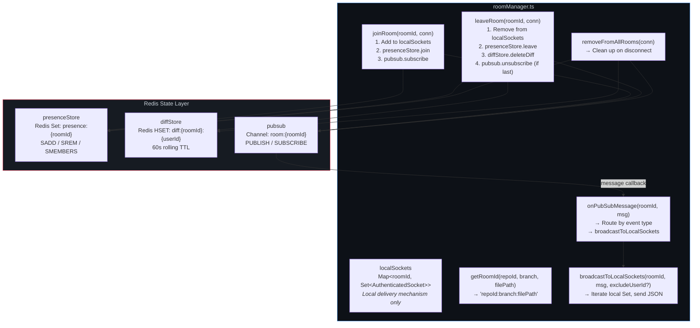
```mermaid
graph TB
    subgraph ROOM_MANAGER["roomManager.ts"]
        direction TB
        LS["localSockets<br/>Map&lt;roomId, Set&lt;AuthenticatedSocket&gt;&gt;<br/><i>Local delivery mechanism only</i>"]
        GRI["getRoomId(repoId, branch, filePath)<br/>→ 'repoId:branch:filePath'"]
        JR["joinRoom(roomId, conn)<br/>1. Add to localSockets<br/>2. presenceStore.join<br/>3. pubsub.subscribe"]
        LR["leaveRoom(roomId, conn)<br/>1. Remove from localSockets<br/>2. presenceStore.leave<br/>3. diffStore.deleteDiff<br/>4. pubsub.unsubscribe (if last)"]
        BLS["broadcastToLocalSockets(roomId, msg, excludeUserId?)<br/>→ Iterate local Set, send JSON"]
        RAFR["removeFromAllRooms(conn)<br/>→ Clean up on disconnect"]
        OPM["onPubSubMessage(roomId, msg)<br/>→ Route by event type<br/>→ broadcastToLocalSockets"]
    end

    subgraph REDIS_STATE["Redis State Layer"]
        PS["presenceStore<br/>Redis Set: presence:{roomId}<br/>SADD / SREM / SMEMBERS"]
        DS["diffStore<br/>Redis HSET: diff:{roomId}:{userId}<br/>60s rolling TTL"]
        PB["pubsub<br/>Channel: room:{roomId}<br/>PUBLISH / SUBSCRIBE"]
    end

    JR --> PS
    JR --> PB
    LR --> PS
    LR --> DS
    LR --> PB
    RAFR --> PS
    RAFR --> DS
    RAFR --> PB
    OPM --> BLS

    PB -->|"message callback"| OPM

    style ROOM_MANAGER fill:#0d1117,stroke:#58a6ff,color:#c9d1d9
    style REDIS_STATE fill:#161b22,stroke:#e94560,color:#c9d1d9
```

---

## 8. Component: Multi-Layer Caching System

### 8.1 System Description

The caching system uses a **3-tier waterfall** for file base content and a separate **in-memory snapshot cache** for file trees.

**Base Content Cache (L1 → L2 → L3):**
| Layer | Implementation | Latency | TTL | Capacity |
|-------|---------------|---------|-----|----------|
| **L1** | LRU Cache (in-process, doubly-linked list + HashMap) | sub-ms | Eviction-based | 100 entries (~5 MB) |
| **L2** | Redis `SET base:{roomId}` | ~1ms | 24 hours (`EX 86400`) | Shared across instances |
| **L3** | GitHub API via Octokit (authoritative) | ~200-500ms | N/A | Rate-limited |

**Branch Snapshot Cache:**
| Storage | Implementation | TTL | Purpose |
|---------|---------------|-----|---------|
| In-memory `Map` | `branchCache.ts` | 5 minutes (lazy eviction) | Tree structure + lazily-populated file contents |

### 8.2 LLD — Cache Waterfall

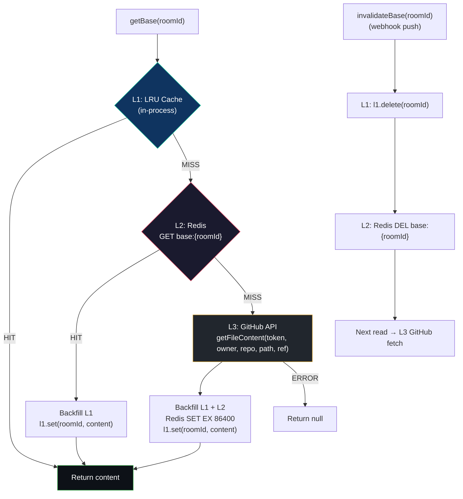
```mermaid
flowchart TD
    REQ["getBase(roomId)"] --> L1{"L1: LRU Cache<br/>(in-process)"}
    L1 -- HIT --> RET["Return content"]
    L1 -- MISS --> L2{"L2: Redis<br/>GET base:{roomId}"}
    L2 -- HIT --> BF1["Backfill L1<br/>l1.set(roomId, content)"]
    BF1 --> RET
    L2 -- MISS --> L3["L3: GitHub API<br/>getFileContent(token, owner, repo, path, ref)"]
    L3 --> BF2["Backfill L1 + L2<br/>Redis SET EX 86400<br/>l1.set(roomId, content)"]
    BF2 --> RET
    L3 -- ERROR --> RNULL["Return null"]

    INV["invalidateBase(roomId)<br/>(webhook push)"] --> DEL1["L1: l1.delete(roomId)"]
    DEL1 --> DEL2["L2: Redis DEL base:{roomId}"]
    DEL2 --> DONE["Next read → L3 GitHub fetch"]

    style L1 fill:#0f3460,stroke:#16c79a,color:#fff
    style L2 fill:#1a1a2e,stroke:#e94560,color:#fff
    style L3 fill:#21262d,stroke:#d29922,color:#fff
    style RET fill:#0d1117,stroke:#3fb950,color:#fff
```

### 8.3 LLD — LRU Cache Internal Structure

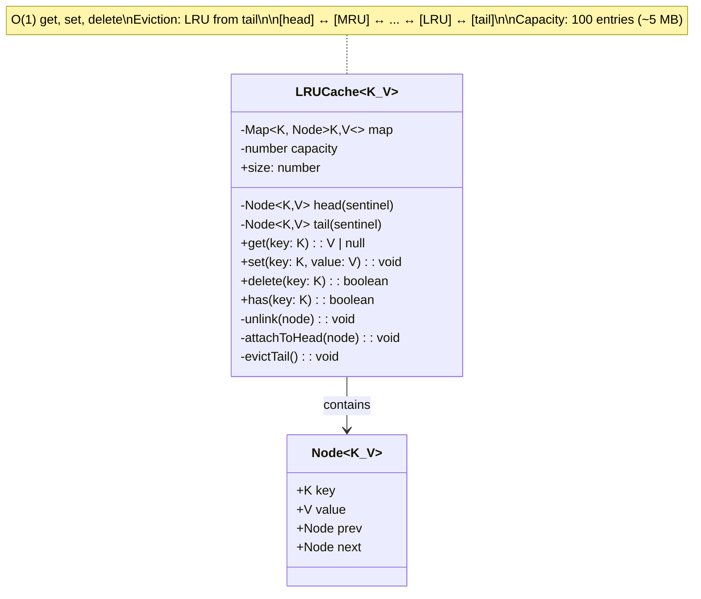
```mermaid
classDiagram
    class LRUCache~K_V~ {
        -Map~K, Node~K,V~~ map
        -Node~K,V~ head  (sentinel)
        -Node~K,V~ tail  (sentinel)
        -number capacity
        +get(key: K): V | null
        +set(key: K, value: V): void
        +delete(key: K): boolean
        +has(key: K): boolean
        +size: number
        -unlink(node): void
        -attachToHead(node): void
        -evictTail(): void
    }

    class Node~K_V~ {
        +K key
        +V value
        +Node prev
        +Node next
    }

    LRUCache --> Node : contains

    note for LRUCache "O(1) get, set, delete\nEviction: LRU from tail\n\n[head] ↔ [MRU] ↔ ... ↔ [LRU] ↔ [tail]\n\nCapacity: 100 entries (~5 MB)"
```

---

## 9. Component: In-File Chat System

### 9.1 System Description

The chat system provides **persistent, encrypted, file-scoped messaging**:

- **Scope:** Messages belong to a room (`repoId:branch:filePath`), matching the collaboration room model.
- **Transport:** Uses the existing WebSocket connection — no additional endpoints.
- **Encryption:** AES-256-CBC at rest in PostgreSQL. The `message_enc` column stores `iv:ciphertextHex`. Decryption happens server-side before sending to clients. Same `ENCRYPTION_KEY` as GitHub tokens.
- **Fan-Out:** Redis PubSub distributes messages across server instances. Redis never stores chat data persistently.
- **Pagination:** Cursor-based using PG serial `id`. Initial load = last 7 days (max 50). Older messages loaded on demand (up to 30 days).
- **Deletion:** Owner-only enforcement via `WHERE id = $1 AND user_id = $2`.
- **Cleanup:** A `setInterval` in `index.ts` runs every 24 hours: `DELETE FROM chat_messages WHERE created_at < NOW() - INTERVAL '30 days'`.

### 9.2 LLD — Chat Message Lifecycle

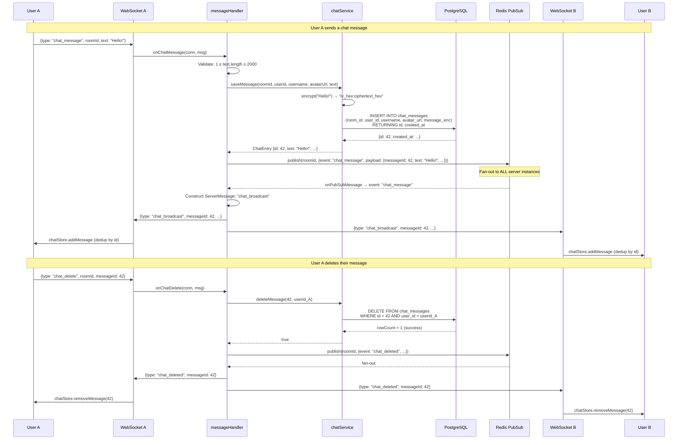
```mermaid
sequenceDiagram
    participant UserA as User A
    participant WS_A as WebSocket A
    participant Handler as messageHandler
    participant ChatSvc as chatService
    participant DB as PostgreSQL
    participant PubSub as Redis PubSub
    participant WS_B as WebSocket B
    participant UserB as User B

    Note over UserA,UserB: User A sends a chat message

    UserA->>WS_A: {type: "chat_message", roomId, text: "Hello!"}
    WS_A->>Handler: onChatMessage(conn, msg)
    Handler->>Handler: Validate: 1 ≤ text.length ≤ 2000

    Handler->>ChatSvc: saveMessage(roomId, userId, username, avatarUrl, text)
    ChatSvc->>ChatSvc: encrypt("Hello!") → "iv_hex:ciphertext_hex"
    ChatSvc->>DB: INSERT INTO chat_messages<br/>(room_id, user_id, username, avatar_url, message_enc)<br/>RETURNING id, created_at
    DB-->>ChatSvc: {id: 42, created_at: ...}
    ChatSvc-->>Handler: ChatEntry {id: 42, text: "Hello!", ...}

    Handler->>PubSub: publish(roomId, {event: "chat_message", payload: {messageId: 42, text: "Hello!", ...}})
    Note over PubSub: Fan-out to ALL server instances

    PubSub-->>Handler: onPubSubMessage → event: "chat_message"
    Handler->>Handler: Construct ServerMessage: "chat_broadcast"
    Handler->>WS_A: {type: "chat_broadcast", messageId: 42, ...}
    Handler->>WS_B: {type: "chat_broadcast", messageId: 42, ...}

    WS_A->>UserA: chatStore.addMessage (dedup by id)
    WS_B->>UserB: chatStore.addMessage (dedup by id)

    Note over UserA,UserB: User A deletes their message

    UserA->>WS_A: {type: "chat_delete", roomId, messageId: 42}
    WS_A->>Handler: onChatDelete(conn, msg)
    Handler->>ChatSvc: deleteMessage(42, userId_A)
    ChatSvc->>DB: DELETE FROM chat_messages<br/>WHERE id = 42 AND user_id = userId_A
    DB-->>ChatSvc: rowCount = 1 (success)
    ChatSvc-->>Handler: true

    Handler->>PubSub: publish(roomId, {event: "chat_deleted", ...})
    PubSub-->>Handler: fan-out
    Handler->>WS_A: {type: "chat_deleted", messageId: 42}
    Handler->>WS_B: {type: "chat_deleted", messageId: 42}

    WS_A->>UserA: chatStore.removeMessage(42)
    WS_B->>UserB: chatStore.removeMessage(42)
```

### 9.3 LLD — ChatPanel Component State Machine

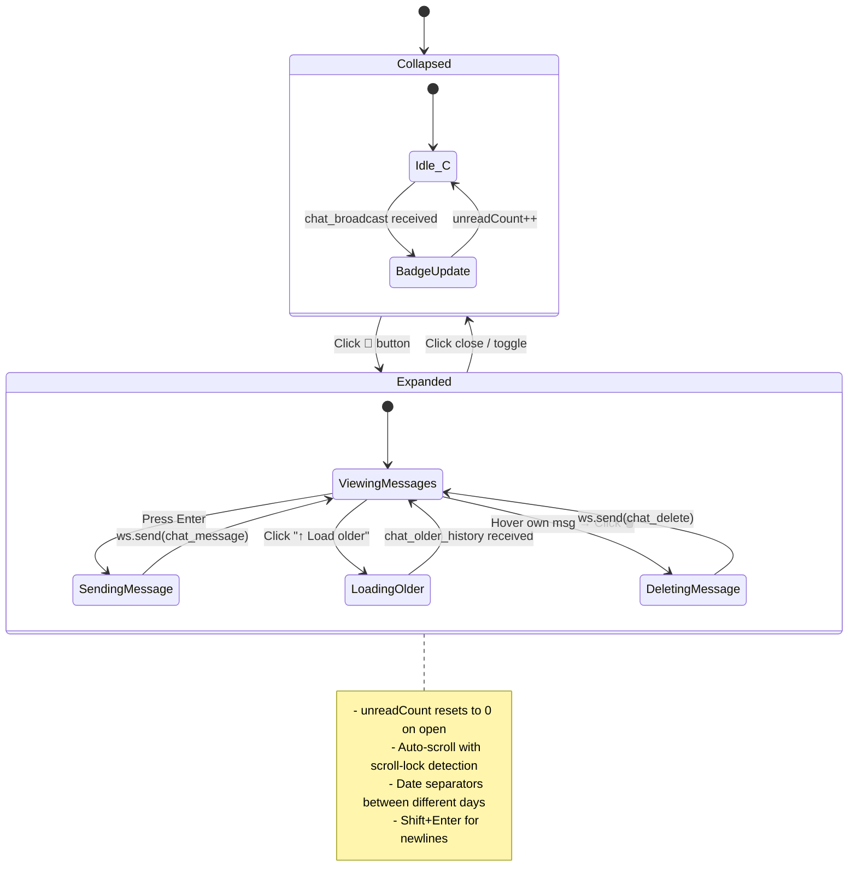
```mermaid
stateDiagram-v2
    [*] --> Collapsed

    Collapsed --> Expanded : Click 💬 button
    Expanded --> Collapsed : Click close / toggle

    state Collapsed {
        [*] --> Idle_C
        Idle_C --> BadgeUpdate : chat_broadcast received
        BadgeUpdate --> Idle_C : unreadCount++
    }

    state Expanded {
        [*] --> ViewingMessages
        ViewingMessages --> SendingMessage : Press Enter
        SendingMessage --> ViewingMessages : ws.send(chat_message)
        ViewingMessages --> LoadingOlder : Click "↑ Load older"
        LoadingOlder --> ViewingMessages : chat_older_history received
        ViewingMessages --> DeletingMessage : Hover own msg → Click 🗑
        DeletingMessage --> ViewingMessages : ws.send(chat_delete)
    }

    note right of Expanded
        - unreadCount resets to 0 on open
        - Auto-scroll with scroll-lock detection
        - Date separators between different days
        - Shift+Enter for newlines
    end note
```

---

## 10. Component: GitHub Webhook Pipeline

### 10.1 System Description

The webhook system handles **incoming GitHub push events** and propagates awareness to live collaboration sessions:

1. **Reception:** `POST /webhooks/github` — NOT behind JWT auth. Security comes from HMAC-SHA256 signature verification using `GITHUB_WEBHOOK_SECRET`.

2. **Raw Body Capture:** A `preParsing` hook captures the exact raw bytes GitHub signed (since `JSON.stringify(req.body)` breaks HMAC). Stored as `rawBody` on the request.

3. **Signature Verification:** Timing-safe comparison of `X-Hub-Signature-256` header against `sha256=HMAC(rawBody, secret)`.

4. **Event Persistence:** All valid webhook events are stored in `webhook_events` table with full JSON payload for audit/replay.

5. **Push Event Processing:** For `push` events specifically:
   - Extract branch name from `refs/heads/...`
   - Collect all modified files from `commits[].modified`
   - For each changed file: invalidate the base cache (L1 + L2) and publish `remote_push` via Redis PubSub
   - All peers editing that file see a live banner notification

6. **Event Retrieval:** `GET /api/repos/:repoId/events` returns paginated webhook events for display in the `WebhookLog` component.

### 10.2 LLD — Webhook Processing Pipeline

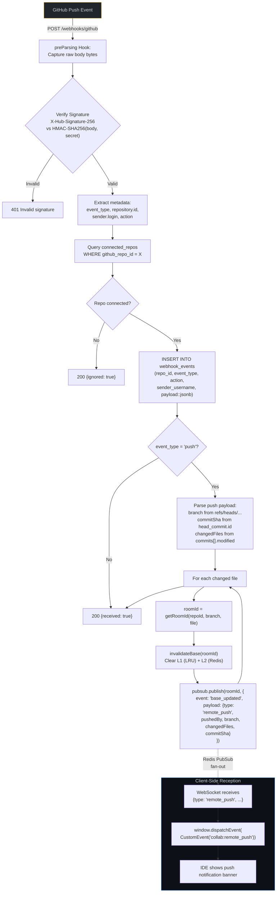
```mermaid
flowchart TD
    GH["GitHub Push Event"] -->|"POST /webhooks/github"| PP["preParsing Hook:<br/>Capture raw body bytes"]
    PP --> SV{"Verify Signature<br/>X-Hub-Signature-256<br/>vs HMAC-SHA256(body, secret)"}
    SV -- Invalid --> R401["401 Invalid signature"]
    SV -- Valid --> EXT["Extract metadata:<br/>event_type, repository.id,<br/>sender.login, action"]

    EXT --> MATCH["Query connected_repos<br/>WHERE github_repo_id = X"]
    MATCH --> MR{"Repo connected?"}
    MR -- No --> IGN["200 {ignored: true}"]
    MR -- Yes --> PERSIST["INSERT INTO webhook_events<br/>(repo_id, event_type, action,<br/>sender_username, payload::jsonb)"]

    PERSIST --> EVT{"event_type = 'push'?"}
    EVT -- No --> OK["200 {received: true}"]
    EVT -- Yes --> PARSE["Parse push payload:<br/>branch from refs/heads/...<br/>commitSha from head_commit.id<br/>changedFiles from commits[].modified"]

    PARSE --> LOOP["For each changed file"]
    LOOP --> ROOMID["roomId = getRoomId(repoId, branch, file)"]
    ROOMID --> INV["invalidateBase(roomId)<br/>Clear L1 (LRU) + L2 (Redis)"]
    INV --> PUB["pubsub.publish(roomId, {<br/>  event: 'base_updated',<br/>  payload: {type: 'remote_push',<br/>    pushedBy, branch,<br/>    changedFiles, commitSha}<br/>})"]
    PUB --> LOOP
    LOOP --> OK

    subgraph CLIENT_SIDE["Client-Side Reception"]
        WS_RCV["WebSocket receives<br/>{type: 'remote_push', ...}"]
        WS_RCV --> DISP["window.dispatchEvent(<br/>CustomEvent('collab:remote_push'))"]
        DISP --> BANNER["IDE shows push notification banner"]
    end

    PUB -.->|"Redis PubSub<br/>fan-out"| WS_RCV

    style GH fill:#21262d,stroke:#d29922,color:#c9d1d9
    style CLIENT_SIDE fill:#0d1117,stroke:#58a6ff,color:#c9d1d9
```

---

## 11. Database Schema (ERD)

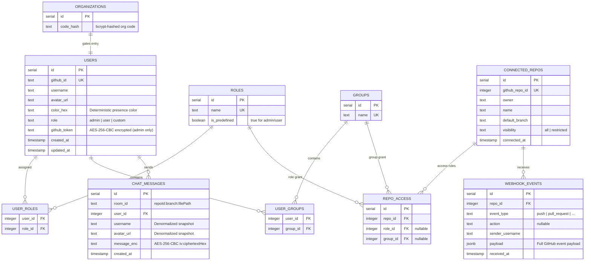
```mermaid
erDiagram
    ORGANIZATIONS {
        serial id PK
        text code_hash "bcrypt-hashed org code"
    }

    USERS {
        serial id PK
        text github_id UK
        text username
        text avatar_url
        text color_hex "Deterministic presence color"
        text role "admin | user | custom"
        text github_token "AES-256-CBC encrypted (admin only)"
        timestamp created_at
        timestamp updated_at
    }

    ROLES {
        serial id PK
        text name UK
        boolean is_predefined "true for admin/user"
    }

    GROUPS {
        serial id PK
        text name UK
    }

    USER_ROLES {
        integer user_id FK
        integer role_id FK
    }

    USER_GROUPS {
        integer user_id FK
        integer group_id FK
    }

    CONNECTED_REPOS {
        serial id PK
        integer github_repo_id UK
        text owner
        text name
        text default_branch
        text visibility "all | restricted"
        timestamp connected_at
    }

    REPO_ACCESS {
        serial id PK
        integer repo_id FK
        integer role_id FK "nullable"
        integer group_id FK "nullable"
    }

    WEBHOOK_EVENTS {
        serial id PK
        integer repo_id FK
        text event_type "push | pull_request | ..."
        text action "nullable"
        text sender_username
        jsonb payload "Full GitHub event payload"
        timestamp received_at
    }

    CHAT_MESSAGES {
        serial id PK
        text room_id "repoId:branch:filePath"
        integer user_id FK
        text username "Denormalized snapshot"
        text avatar_url "Denormalized snapshot"
        text message_enc "AES-256-CBC iv:ciphertextHex"
        timestamp created_at
    }

    ORGANIZATIONS ||--|| USERS : "gates entry"
    USERS ||--o{ USER_ROLES : "assigned"
    USERS ||--o{ USER_GROUPS : "member of"
    ROLES ||--o{ USER_ROLES : "contains"
    GROUPS ||--o{ USER_GROUPS : "contains"
    CONNECTED_REPOS ||--o{ REPO_ACCESS : "access rules"
    ROLES ||--o{ REPO_ACCESS : "role grant"
    GROUPS ||--o{ REPO_ACCESS : "group grant"
    CONNECTED_REPOS ||--o{ WEBHOOK_EVENTS : "receives"
    USERS ||--o{ CHAT_MESSAGES : "sends"
```

### Migration History

| Migration | File | Tables Created |
|-----------|------|---------------|
| 001 | `001_init.sql` | `users`, `organizations` |
| 002 | `002_admin_portal.sql` | `connected_repos`, `roles`, `groups`, `user_roles`, `user_groups`, `repo_access` |
| 003 | `003_webhooks.sql` | `webhook_events` |
| 004 | `004_add_webhook_id.sql` | Alter `webhook_events` |
| 005 | `005_chat.sql` | `chat_messages` (with composite indexes) |

---

## 12. State Management Architecture

### 12.1 LLD — Zustand Store Relationships

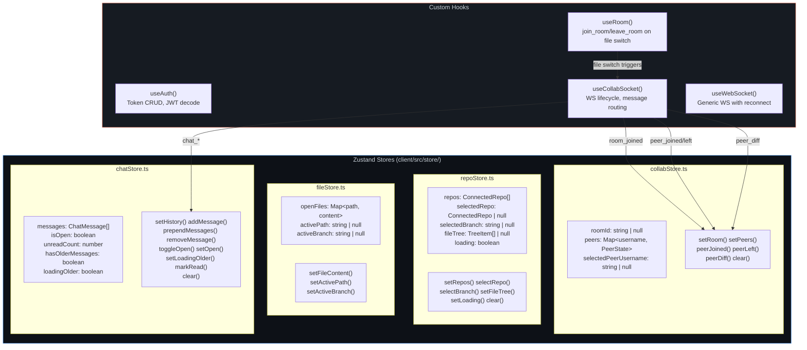
```mermaid
graph TB
    subgraph CLIENT_STORES["Zustand Stores (client/src/store/)"]
        direction TB

        subgraph REPO_STORE["repoStore.ts"]
            RS_STATE["repos: ConnectedRepo[]<br/>selectedRepo: ConnectedRepo | null<br/>selectedBranch: string | null<br/>fileTree: TreeItem[] | null<br/>loading: boolean"]
            RS_ACTIONS["setRepos() selectRepo()<br/>selectBranch() setFileTree()<br/>setLoading() clear()"]
        end

        subgraph FILE_STORE["fileStore.ts"]
            FS_STATE["openFiles: Map&lt;path, content&gt;<br/>activePath: string | null<br/>activeBranch: string | null"]
            FS_ACTIONS["setFileContent()<br/>setActivePath()<br/>setActiveBranch()"]
        end

        subgraph COLLAB_STORE["collabStore.ts"]
            CS_STATE["roomId: string | null<br/>peers: Map&lt;username, PeerState&gt;<br/>selectedPeerUsername: string | null"]
            CS_ACTIONS["setRoom() setPeers()<br/>peerJoined() peerLeft()<br/>peerDiff() clear()"]
        end

        subgraph CHAT_STORE["chatStore.ts"]
            CHS_STATE["messages: ChatMessage[]<br/>isOpen: boolean<br/>unreadCount: number<br/>hasOlderMessages: boolean<br/>loadingOlder: boolean"]
            CHS_ACTIONS["setHistory() addMessage()<br/>prependMessages() removeMessage()<br/>toggleOpen() setOpen()<br/>setLoadingOlder() markRead()<br/>clear()"]
        end
    end

    subgraph HOOKS["Custom Hooks"]
        UA["useAuth()<br/>Token CRUD, JWT decode"]
        UCS["useCollabSocket()<br/>WS lifecycle, message routing"]
        UR["useRoom()<br/>join_room/leave_room on file switch"]
        UWS["useWebSocket()<br/>Generic WS with reconnect"]
    end

    UCS -->|"room_joined"| CS_ACTIONS
    UCS -->|"peer_joined/left"| CS_ACTIONS
    UCS -->|"peer_diff"| CS_ACTIONS
    UCS -->|"chat_*"| CHS_ACTIONS
    UR -->|"file switch triggers"| UCS

    style CLIENT_STORES fill:#0d1117,stroke:#58a6ff,color:#c9d1d9
    style HOOKS fill:#161b22,stroke:#f78166,color:#c9d1d9
```

### 12.2 LLD — Server-Side Redis State

```mermaid
graph TB
    subgraph REDIS["Redis Data Structures"]
        direction TB

        subgraph PRESENCE["Presence (D1)"]
            P_TYPE["Type: SET"]
            P_KEY["Key: presence:{roomId}"]
            P_VAL["Members: userId (as string)"]
            P_TTL["TTL: None (explicit lifecycle)"]
            P_OPS["SADD on join<br/>SREM on leave<br/>SMEMBERS for peer list"]
        end

        subgraph DIFFS["Diff Snapshots (D3)"]
            D_TYPE["Type: HSET"]
            D_KEY["Key: diff:{roomId}:{userId}"]
            D_FIELD["Field: 'patch'"]
            D_VAL["Value: JSON-stringified patches"]
            D_TTL["TTL: 60s rolling (dead-man switch)"]
            D_OPS["HSET + EXPIRE on edit<br/>HGET for hydration<br/>DEL on disconnect"]
        end

        subgraph BASE["Base Content (D2)"]
            B_TYPE["Type: STRING"]
            B_KEY["Key: base:{roomId}"]
            B_VAL["Value: Raw file content"]
            B_TTL["TTL: 24h (EX 86400)"]
            B_OPS["SET on L3 fetch<br/>GET for L2 lookup<br/>DEL on webhook invalidation"]
        end

        subgraph PUBSUB["PubSub Channels"]
            PS_CH["Channel: room:{roomId}"]
            PS_EVENTS["Events:<br/>peer_diff | peer_joined | peer_left<br/>base_updated | chat_message | chat_deleted"]
            PS_CLI["Clients:<br/>redisClient (publish)<br/>redisPubSubClient (subscribe)"]
        end
    end

    style REDIS fill:#0d1117,stroke:#e94560,color:#c9d1d9
```

---

## 13. Security Architecture

### 13.1 LLD — Security Layers

```mermaid
flowchart TB
    subgraph ENTRY["Entry Gate"]
        OC["Organization Code<br/>bcrypt-hashed in DB<br/>Verified twice (pre-OAuth + callback)"]
    end

    subgraph AUTH_LAYER["Authentication"]
        JWT_S["JWT (HS256)<br/>Signed with JWT_SECRET<br/>7-day expiry<br/>Payload: userId, username, role, color"]
        HTTP_AUTH["REST: Authorization: Bearer token<br/>Validated by requireAuth middleware"]
        WS_AUTH["WS: ?token= query parameter<br/>Validated during upgrade handshake<br/>Invalid → close(4401)"]
    end

    subgraph AUTHZ["Authorization"]
        RBAC_E["Role-Based Access Control<br/>canAccess(userId, repoId)<br/>Checks visibility + repo_access<br/>JOIN user_roles / user_groups"]
        ADMIN["Admin Guard<br/>requireAdmin middleware<br/>role === 'admin'"]
    end

    subgraph CRYPTO["Cryptography"]
        AES["AES-256-CBC<br/>32-char ENCRYPTION_KEY<br/>Random IV per operation<br/>Format: iv_hex:ciphertext_hex"]
        AES_TARGETS["Encrypted Data:<br/>1. Admin GitHub token (at rest in PG)<br/>2. Chat messages (at rest in PG)"]
    end

    subgraph WEBHOOK_SEC["Webhook Security"]
        HMAC["HMAC-SHA256<br/>X-Hub-Signature-256 header<br/>Timing-safe comparison<br/>Raw body capture for integrity"]
    end

    subgraph CHAT_SEC["Chat Security"]
        OWN["Owner-only deletion<br/>WHERE id = $1 AND user_id = $2<br/>Server-enforced ownership"]
        ENC["Encrypted at rest<br/>(not E2E — server decrypts)"]
        LIFE["30-day retention limit<br/>24h cleanup interval"]
    end

    ENTRY --> AUTH_LAYER
    AUTH_LAYER --> AUTHZ
    AUTHZ --> CRYPTO
    CRYPTO --> AES_TARGETS

    style ENTRY fill:#1a1a2e,stroke:#ffd700,color:#fff
    style AUTH_LAYER fill:#0f3460,stroke:#16c79a,color:#fff
    style AUTHZ fill:#0d1117,stroke:#58a6ff,color:#c9d1d9
    style CRYPTO fill:#21262d,stroke:#e94560,color:#c9d1d9
    style WEBHOOK_SEC fill:#21262d,stroke:#d29922,color:#c9d1d9
    style CHAT_SEC fill:#161b22,stroke:#3fb950,color:#c9d1d9
```

---

## 14. Deployment Topology

### 14.1 LLD — Production Deployment

```mermaid
graph TB
    subgraph CLIENTS["End Users"]
        B1["Browser 1"]
        B2["Browser 2"]
        B3["Browser N"]
    end

    subgraph LB["Load Balancer / Reverse Proxy"]
        NGINX["nginx / Cloudflare<br/>TLS termination<br/>WS upgrade support"]
    end

    subgraph APP_TIER["Application Tier (Horizontal Scale)"]
        direction LR
        F1["Fastify Instance 1<br/>REST + WS<br/>L1 LRU Cache"]
        F2["Fastify Instance 2<br/>REST + WS<br/>L1 LRU Cache"]
        F3["Fastify Instance N<br/>REST + WS<br/>L1 LRU Cache"]
    end

    subgraph DATA_TIER["Data Tier"]
        PG_PRIMARY["PostgreSQL Primary<br/>users, repos, roles,<br/>groups, chat, webhooks"]
        REDIS_CLUSTER["Redis<br/>Commands Client<br/>+ PubSub Client<br/>(presence, diffs, base, channels)"]
    end

    subgraph EXTERNAL_SVC["External"]
        GH["GitHub API<br/>+ OAuth<br/>+ Webhooks"]
    end

    B1 & B2 & B3 -->|"HTTPS + WSS"| NGINX
    NGINX --> F1 & F2 & F3
    F1 & F2 & F3 --> PG_PRIMARY
    F1 & F2 & F3 --> REDIS_CLUSTER
    F1 & F2 & F3 --> GH
    GH -->|"Webhooks<br/>POST /webhooks/github"| NGINX

    REDIS_CLUSTER -.->|"PubSub fan-out<br/>Cross-instance sync"| F1 & F2 & F3

    style CLIENTS fill:#0d1117,stroke:#58a6ff,color:#c9d1d9
    style LB fill:#21262d,stroke:#d29922,color:#c9d1d9
    style APP_TIER fill:#161b22,stroke:#f78166,color:#c9d1d9
    style DATA_TIER fill:#0d1117,stroke:#3fb950,color:#c9d1d9
    style EXTERNAL_SVC fill:#21262d,stroke:#d29922,color:#c9d1d9
```

### 14.2 Environment Variables

| Variable | Layer | Purpose |
|----------|-------|---------|
| `DATABASE_URL` | Data | PostgreSQL connection string |
| `REDIS_URL` | Data | Redis connection string |
| `GITHUB_CLIENT_ID` | Auth | GitHub OAuth App client ID |
| `GITHUB_CLIENT_SECRET` | Auth | GitHub OAuth App client secret |
| `GITHUB_CALLBACK_URL` | Auth | OAuth callback URL override |
| `GITHUB_WEBHOOK_SECRET` | Security | HMAC secret for webhook verification |
| `JWT_SECRET` | Auth | HMAC key for JWT signing |
| `JWT_EXPIRES_IN` | Auth | Token expiry (default: `7d`) |
| `ENCRYPTION_KEY` | Crypto | 32-char key for AES-256-CBC |
| `ADMIN_GITHUB_USERNAME` | Auth | Auto-detects admin user during OAuth |
| `ORG_CODE` | Auth | Seeded into `organizations` table |
| `CLIENT_URL` | CORS | Allowed origin for CORS + redirects |
| `PORT` | Server | Listen port (default: `3001`) |
| `VITE_API_URL` | Client | Backend API base URL |

---

## File Index — Complete Source Map

### Server (`server/src/`)

| Path | Category | Description |
|------|----------|-------------|
| `index.ts` | Entry | App bootstrap, plugin registration, seeding, cleanup timer |
| `auth/jwt.ts` | Auth | JWT sign/verify with `jsonwebtoken` |
| `auth/crypto.ts` | Auth | AES-256-CBC encrypt/decrypt |
| `auth/github.strategy.ts` | Auth | Passport GitHub strategy with org code gate |
| `middleware/requireAuth.ts` | Middleware | JWT bearer extraction + verification |
| `middleware/requireAdmin.ts` | Middleware | Auth + admin role check |
| `plugins/session.plugin.ts` | Plugin | `@fastify/session` + `@fastify/cookie` |
| `plugins/passport.plugin.ts` | Plugin | Passport.js initialization |
| `plugins/wsPlugin.ts` | Plugin | WebSocket endpoint with JWT upgrade auth |
| `routes/auth.routes.ts` | Routes | verify-code, github, callback, logout |
| `routes/admin.routes.ts` | Routes | Repo connect, roles, groups, users, access |
| `routes/repo.routes.ts` | Routes | User repos, branches, tree, snapshot, file |
| `routes/webhook.routes.ts` | Routes | GitHub webhook receiver + event API |
| `routes/github.routes.ts` | Routes | Stub for future GitHub API endpoints |
| `services/github.service.ts` | Service | Octokit wrapper for repos, branches, trees, files |
| `services/token.service.ts` | Service | Fetch + decrypt admin GitHub token |
| `services/chatService.ts` | Service | Encrypted chat CRUD with cursor pagination |
| `ws/ws.types.ts` | Types | ClientMessage, ServerMessage, DiffPatch unions |
| `ws/roomManager.ts` | WS | Local socket registry + Redis presence/PubSub |
| `ws/messageHandler.ts` | WS | Message router for all 6 client message types |
| `state/redis.client.ts` | State | Dual Redis connections (commands + PubSub) |
| `state/presenceStore.ts` | State | Redis Set for room presence |
| `state/diffStore.ts` | State | Redis HSET for user diff snapshots (60s TTL) |
| `state/baseCache.ts` | State | Thin wrapper delegating to cacheManager |
| `state/cacheManager.ts` | State | L1→L2→L3 waterfall for base file content |
| `state/lru.ts` | State | Manual LRU cache (HashMap + doubly-linked list) |
| `state/pubsub.ts` | State | Redis PubSub publish/subscribe wrapper |
| `cache/branchCache.ts` | Cache | In-memory branch tree + file content cache (5m TTL) |
| `db/client.ts` | DB | `pg.Pool` connection against `DATABASE_URL` |
| `db/seedOrgCode.ts` | DB | Boot-time org code hash seeding |
| `db/seedRoles.ts` | DB | Boot-time predefined role seeding |
| `db/seedUsers.ts` | DB | Boot-time user seeding |
| `db/migrations/*.sql` | DB | 5 sequential migration files |

### Client (`client/src/`)

| Path | Category | Description |
|------|----------|-------------|
| `main.tsx` | Entry | React DOM root with BrowserRouter |
| `App.tsx` | Routing | Route definitions with RequireAuth/RequireAdmin guards |
| `pages/Login.tsx` | Page | Org code entry + GitHub OAuth redirect |
| `pages/AuthCallback.tsx` | Page | Token capture from URL → localStorage |
| `pages/InvalidCode.tsx` | Page | Error page for failed org code verification |
| `pages/Dashboard.tsx` | Page | RBAC-filtered repo grid |
| `pages/RepoBrowser.tsx` | Page | Read-only file browser with Monaco |
| `pages/AdminDashboard.tsx` | Page | Repo connection, RBAC management |
| `pages/IDE.tsx` | Page | Collaborative editor (3-column layout) |
| `components/CollabEditor.tsx` | Component | Editable Monaco with diff sending |
| `components/PresenceBar.tsx` | Component | Colored peer avatars |
| `components/PeerDiffWindow.tsx` | Component | Read-only peer document viewer |
| `components/PeerDiffGutter.tsx` | Component | Diff gutter decorations |
| `components/ChatPanel.tsx` | Component | Collapsible chat overlay |
| `components/BranchSelector.tsx` | Component | Branch dropdown |
| `components/Editor.tsx` | Component | Base Monaco editor wrapper |
| `components/FileTree.tsx` | Component | Recursive file tree |
| `components/WebhookLog.tsx` | Component | Recent webhook events list |
| `hooks/useAuth.ts` | Hook | JWT token CRUD, client-side decode, logout |
| `hooks/useCollabSocket.ts` | Hook | WebSocket lifecycle + message routing |
| `hooks/useRoom.ts` | Hook | Room join/leave on file switch |
| `hooks/useWebSocket.ts` | Hook | Generic WebSocket with exponential backoff |
| `store/repoStore.ts` | Store | Repo, branch, tree state |
| `store/fileStore.ts` | Store | Open files, active path/branch |
| `store/collabStore.ts` | Store | Collab room, peers, diffs |
| `store/chatStore.ts` | Store | Chat messages, panel UI state |
| `api/client.ts` | API | Axios instance with JWT interceptor |
| `api/admin.ts` | API | Admin API function mappings |
| `api/repo.ts` | API | Repo API function mappings |
| `lib/wsUrl.ts` | Utility | WebSocket URL builder |
