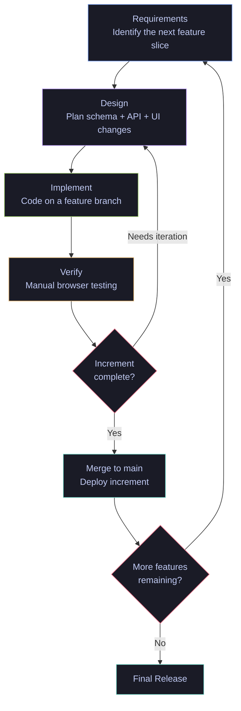
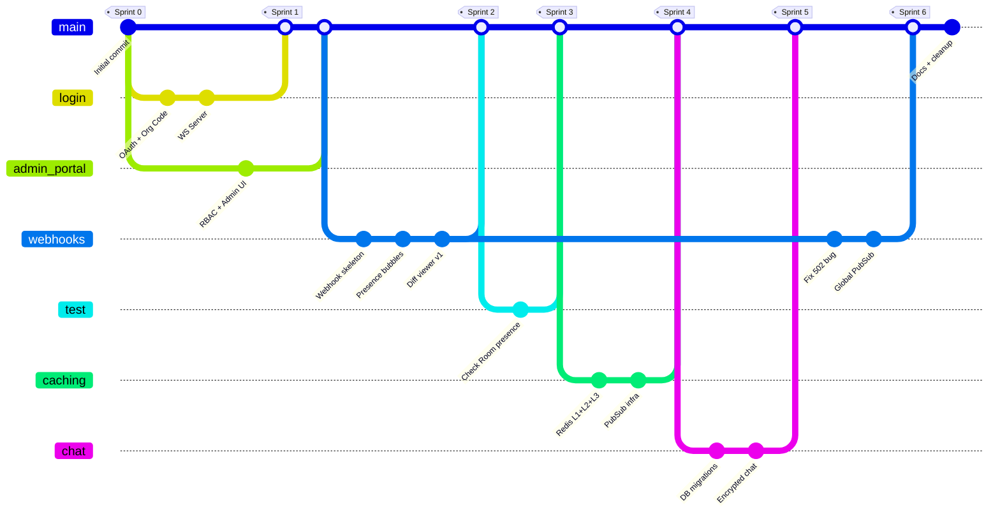
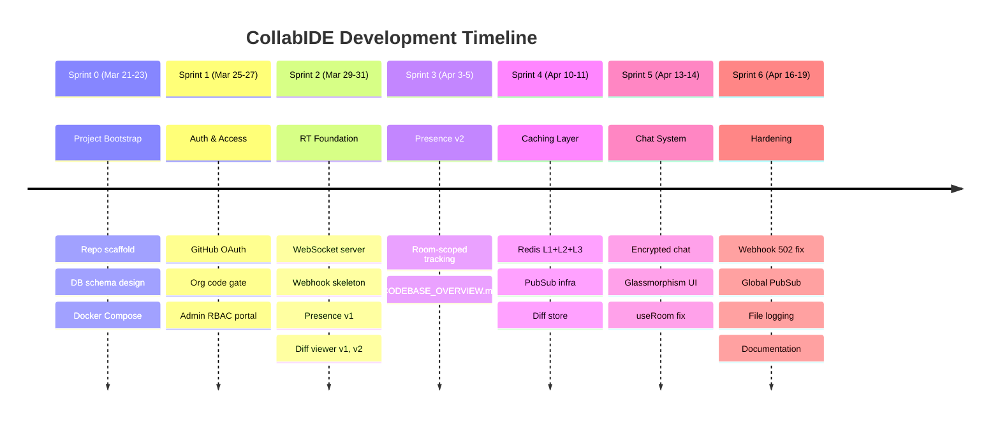
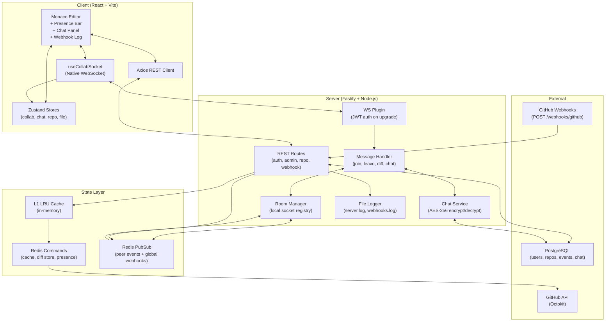
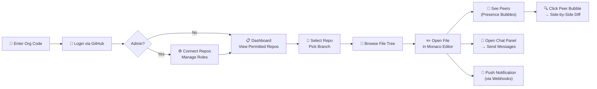

# CollabIDE — Project Context & Development Model

> **Project:** Collaborative IDE with Real-Time Awareness  
> **Course:** B.Tech Project (BTP), Semester 6  
> **Team:** Kriti, Riddhika, Harshita  
> **Repository:** [github.com/kritic2911/collab_ide](https://github.com/kritic2911/collab_ide)  

---

# Part A — Verbose Report Version

*Use this section directly in your BTP report. It provides formal SWE model justification, detailed sprint analysis with evidence from git history, and architectural reasoning.*

---

## 1. Software Engineering Development Model

### 1.1 Model Selection: Iterative Incremental Development

CollabIDE follows the **Iterative Incremental** software development model, augmented with a **Feature-Branch Version Control Workflow**.

In this model, the system is developed through a series of self-contained increments. Each increment delivers a working, testable slice of functionality that builds upon the previous one. Within each increment, iteration is permitted — a feature may be revisited and refined in a later sprint based on integration feedback or changing requirements.

### 1.2 Why Iterative Incremental?

The following project characteristics drove the model selection:

| Constraint | Implication | Why Iterative Incremental Fits |
|---|---|---|
| **Small team (3 people)** | No bandwidth for heavyweight ceremonies | Lightweight sprints with implicit coordination |
| **4 months development window** | Must ship working software fast | Each sprint produces a deployable increment |
| **Evolving requirements** | The diff viewer was redesigned 3 times as we learned what worked | Iteration is a first-class concept, not a failure |
| **No CI/CD or test framework** | Verification is manual and browser-based | Each increment is verified independently before the next starts |
| **Parallel feature development** | Auth, WebSockets, and Admin were developed concurrently on branches | Feature branches enable parallel increments without destabilizing `main` |
| **Real-time system complexity** | WebSocket + Redis + Monaco integration required learning-by-doing | Early increments established foundations that later ones refined |

### 1.3 Why Not Other Models?

| Model | Reason for Rejection |
|---|---|
| **Waterfall** | Requirements evolved continuously. The diff viewer alone underwent 3 major rewrites — waterfall's sequential phases cannot accommodate this. |
| **Scrum** | Requires formal ceremonies (daily standups, sprint planning, retrospectives, a product owner). The 3-person team coordinated informally via GitHub and direct communication. |
| **Kanban** | Lacks the time-boxed delivery rhythm that structured our work. We naturally worked in regular bursts with clear deliverables. |
| **Spiral** | Designed for high-risk, large-scale projects with formal risk analysis phases — overkill for a BTP. |
| **RAD** | Assumes reusable components and automated code generation — not applicable to a custom WebSocket/Monaco integration. |

### 1.4 Model Lifecycle Diagram



### 1.5 Feature-Branch Workflow

Every increment was developed on an isolated Git branch, merged into `main` only after verification. This prevented incomplete features from destabilizing the shared codebase.



---

## 2. Sprint Breakdown

### 2.0 Sprint Summary Table

| Sprint | Theme | Key Deliverable |
|---|---|---|
| **0** | Project Bootstrap | Repo scaffold, DB schema, README |
| **1** | Auth & Access Control | GitHub OAuth, Org code gate, Admin RBAC portal |
| **2** | Real-Time Foundation | WebSocket server, Webhook skeleton, Presence Bar v1, Diff Viewer v1 |
| **3** | Presence Refinement | Room-scoped presence tracking, Codebase overview |
| **4** | State & Caching Layer | Redis L1/L2/L3 cache, PubSub infrastructure |
| **5** | Chat & Collaboration UX | Encrypted in-file chat, useRoom coordination |
| **6** | Webhook Hardening | 502 fix, global PubSub messages |
| **7*** | Deployment & Advanced Collab | OT/CRDT, save-to-GitHub, deployment |

---

### Sprint 0 — Project Bootstrap

**Objective:** Establish the repository structure, database schema, and development environment so all team members can begin parallel work.

**Deliverables:**
- Initialized the GitHub repository with `.gitignore` and project README
- Designed the initial database schema (`users`, `organizations` tables)
- Created the `server/` directory with Fastify boilerplate and `client/` with Vite + React
- Established `docker-compose.yml` for local PostgreSQL
- Wrote migration `001_init.sql`


**Increment Outcome:** A runnable (but empty) full-stack scaffold. Both `npm run dev` commands succeed. Database migrations apply cleanly. All team members can clone, install, and start developing independently.

---

### Sprint 1 — Authentication & Access Control

**Objective:** Implement the complete authentication pipeline (org code → GitHub OAuth → JWT) and the admin portal for connecting and restricting GitHub repositories.

**Deliverables:**
- **Organization Code Gate:** Users must enter a valid org code (bcrypt-verified) before seeing the GitHub login button (`POST /auth/verify-code`)
- **GitHub OAuth Flow:** Passport.js `GitHubStrategy` with state-encoded org code verification, automatic user creation, AES-256-CBC token encryption
- **JWT Issuance:** Signed tokens encoding `userId`, `username`, `role`, and `color` for stateless API auth
- **Admin Dashboard:** Full RBAC management UI — connect repos, create roles/groups, assign access restrictions
- **Migration `002_admin_portal.sql`:** Six new tables (`connected_repos`, `roles`, `user_roles`, `groups`, `user_groups`, `repo_access`)

**Iteration Note:** The admin portal required 3 commits to stabilize — the initial attempt had broken role assignment logic that was fixed iteratively in the next 2 commits. This is a textbook example of within-sprint iteration.

**Increment Outcome:** Users can authenticate via GitHub OAuth, admins can connect repositories and manage access. The `requireAuth` and `requireAdmin` middleware gates are operational.

---

### Sprint 2 — Real-Time Foundation

**Objective:** Build the WebSocket infrastructure, implement the first version of webhook ingestion, and create the initial presence and diff awareness UI.

**Deliverables:**
- **WebSocket Server (`wsPlugin.ts`):** JWT-authenticated connection upgrades via `?token=` query parameter
- **Room Manager (`roomManager.ts`):** In-memory `Map<roomId, Set<Socket>>` with join/leave/broadcast operations
- **Message Handler (`messageHandler.ts`):** Protocol router for `join_room`, `leave_room`, `diff_update`
- **Webhook Routes v1 (`webhook.routes.ts`):** Basic signature verification and DB persistence (migration `003_webhooks.sql`)
- **Presence Bubbles v1:** Colored dots showing who is viewing the same file
- **Diff Viewer v1:** Side-by-side Monaco editor showing peer edits (patch-based reconstruction)
- **Client hooks:** `useCollabSocket.ts`, `useRoom.ts`, `useWebSocket.ts`

**Iteration Note:** The diff viewer went through 2 iterations within this single sprint:
1. **v1**: "basic diff viewer with poor live difference handling."
2. **v2**: "better diff viewer but with some issues with latency and updates"

This demonstrates the iterative nature of the model — the team shipped an imperfect but functional increment, documented its limitations, and planned to revisit it.

**Increment Outcome:** Two users can open the same file and see each other's presence. Diff diffs display but are not yet accurate. Webhooks are received but the broadcast path is incomplete.

---

### Sprint 3 — Presence Refinement

**Objective:** Harden the room-based presence system so it accurately tracks which users are viewing which files, and document the codebase for onboarding.

**Deliverables:**
- **Room Presence Tracking:** Accurate `peer_joined` / `peer_left` events scoped to `repoId:branch:filePath` rooms
- **Codebase Overview Document (`CODEBASE_OVERVIEW.md`):** Comprehensive 17KB technical reference covering all subsystems

**Iteration Context:** This sprint represents the **second iteration** on presence (first was Sprint 2's bubbles). The Sprint 2 implementation showed presence but didn't properly track join/leave across file navigation. Sprint 3 fixed the lifecycle management.

**Increment Outcome:** Presence bubbles now accurately reflect who is in the room. The codebase overview enables any team member to understand the full architecture.

---

### Sprint 4 — State & Caching Layer

**Objective:** Replace in-memory state management with a production-grade Redis-backed caching pipeline that supports horizontal scaling.

**Deliverables:**
- **3-Tier Cache Architecture:**
  - **L1:** In-memory LRU cache (`lru.ts`) — sub-millisecond reads for hot files
  - **L2:** Redis key-value store (`cacheManager.ts`) — shared across server instances
  - **L3:** GitHub API fallback — fetches file content when cache misses
- **Redis PubSub Infrastructure (`pubsub.ts`):** Cross-process message distribution for `peer_diff`, `peer_joined`, `peer_left`, and `base_updated` events
- **Redis Client Lifecycle (`redis.client.ts`):** Dual-connection pattern (commands client + dedicated subscriber client)
- **Diff Store (`diffStore.ts`):** Redis-backed rolling patch storage per user
- **Presence Store (`presenceStore.ts`):** Redis sets for idempotent room participant tracking
- **Docker Compose:** Added Redis service alongside PostgreSQL

**Architectural Significance:** This sprint fundamentally changed the system's scalability characteristics. Before Sprint 4, all state lived in a single Node.js process's memory. After Sprint 4, state is externalized to Redis, enabling multiple backend instances behind a load balancer — a key requirement for production deployment.

**Increment Outcome:** File content is cached across tiers. WebSocket messages relay through Redis PubSub. The system is architecturally ready for horizontal scaling.

---

### Sprint 5 — In-File Chat & Collaboration UX

**Objective:** Add a persistent, encrypted, real-time chat system scoped to file-level collaboration rooms, and refine the room coordination logic.

**Deliverables:**
- **Chat System:**
  - AES-256-CBC encryption at rest (same `ENCRYPTION_KEY` as GitHub tokens)
  - 7-day auto-load + 30-day cursor-based pagination
  - Real-time broadcast via existing Redis PubSub infrastructure
  - Ownership-verified message deletion
  - 24-hour automated cleanup of messages older than 30 days
- **Chat UI (`ChatPanel.tsx`):** Collapsible glassmorphism overlay with unread badge, date separators, hover-to-delete, auto-scroll with scroll-lock
- **useRoom Fix:** Corrected the `join_room` payload coordination between file navigation and room lifecycle
- **New WebSocket Protocol Types:** `chat_message`, `chat_broadcast`, `chat_history`, `chat_older_history`, `chat_deleted`
- **Migration `005_chat.sql`:** `chat_messages` table with encrypted `message_enc` column

**Design Decision:** Chat messages are encrypted at rest but not end-to-end — the server decrypts before relaying. This was a deliberate trade-off: E2E encryption would prevent server-side features like pagination search and automated cleanup. For a BTP-scope project, server-side encryption provides sufficient protection against database-level data exposure.

**Increment Outcome:** Users editing the same file can communicate in real-time. Chat history persists across sessions. The collaboration experience now includes both visual awareness (presence + diff) and communication (chat).

---

### Sprint 6 — Webhook Hardening & Integration 

**Objective:** Fix the broken webhook ingestion pipeline (502 errors), implement branch-wide live awareness notifications, add persistent server-side logging, and produce final documentation.

**Deliverables:**
- **502 Bug Fix:** Replaced the broken Fastify `preParsing` hook (which corrupted the JSON body stream) with a reliable `addContentTypeParser` approach for raw body capture
- **Branch-Wide Broadcasting:**
  - New `broadcastToBranch()` function in `roomManager.ts` — iterates all rooms matching `repoId:branch:*`
  - New `publishGlobalWebhook()` / `subscribeToGlobalWebhooks()` in `pubsub.ts` — Redis channel `global:webhook_pushes` for cross-instance delivery
  - Bootstrap subscriber in `index.ts` — every server instance receives webhook events regardless of which instance the HTTP request hit
- **File Logging (`fileLogger.ts`):**
  - `server/webhooks.log` — detailed webhook pipeline trace (receive → verify → persist → broadcast)
  - `server/server.log` — master log mirroring all webhook entries plus general server events
- **Documentation:** Updated `webhooks_implementation.md`, `CHANGELOG.md`, `README.md`, `.env.example`

**Iteration Context:** This is the **third iteration** on webhooks:
1. **Sprint 2**: Skeleton — basic signature verification, DB storage, per-file broadcast (broken)
2. **Sprint 4**: PubSub infrastructure added, but webhook broadcast still used per-file channels
3. **Sprint 6**: Complete rewrite — fixed body parsing, switched to branch-wide global PubSub channel

This three-iteration arc is the strongest evidence for the Iterative Incremental model. The webhook system required real-world testing (ngrok + GitHub) to surface the 502 bug, which couldn't have been predicted during Sprint 2's initial design.

**Increment Outcome:** Webhooks are fully operational end-to-end. When any developer pushes to a branch, all users viewing any file on that branch receive an instant notification banner. Events are persisted for historical review. The system is documented for team onboarding.

---

### Sprint 7 — Future Scope

**Objective:** Complete the remaining milestones identified in `CODEBASE_OVERVIEW.md` § 4 (Structural Ambiguities & Future Milestones).

**Planned Deliverables:**

| Feature | Description | Complexity |
|---|---|---|
| **Save / Commit to GitHub** | Write-back modified files to GitHub via Octokit Commit API. Users edit locally, then click "Commit" to push changes to the branch without leaving the IDE. | Medium |
| **Operational Transform (OT)** | Apply sequential patches from concurrent editors without corruption. Currently, diff patches are broadcast but not conflict-resolved — two users editing the same line will produce inconsistent states. | High |
| **CRDT Alternative** | If OT proves too complex, evaluate Yjs or Automerge for conflict-free replicated data types that achieve eventual consistency without a central sequencer. | High |
| **CI/CD & Testing** | Add Vitest for unit tests, Playwright for E2E browser tests, and GitHub Actions for automated verification on PR. | Medium |
| **Production Deployment** | Containerize with Docker, deploy to a cloud provider (e.g., Railway, Render, or AWS), replace ngrok with a permanent domain. | Medium |

---

## 3. Iteration Evidence Matrix

This matrix documents which features were iterated across sprints — the definitive proof that the Iterative Incremental model was followed in practice, not just in theory.

| Feature | Sprint 2 (v1) | Sprint 3 (v2) | Sprint 4 (v3) | Sprint 6 (v4) |
|---|---|---|---|---|
| **Diff Viewer** | Patch-based, inaccurate | — | Server-sourced content | Direct content relay via WS |
| **Presence** | Basic colored dots | Room-scoped tracking | Redis-backed presence store | — |
| **Webhooks** | Skeleton, per-file broadcast | — | PubSub infra added | 502 fix, global broadcast, logging |
| **State Management** | In-memory Maps | — | Redis L1/L2/L3 + PubSub | Global webhook channel added |



---

## 4. System Architecture Diagram



---

# Part B — Sparse PPT / Quick Recap Version

*Use this for presentation slides. Each section maps to roughly one slide.*

---

## Slide 1: What is CollabIDE?

A **browser-based collaborative code editor** that connects to GitHub repositories and lets multiple developers:
-  Browse repos, branches, and files (via admin-connected GitHub repos)
-  See who's editing what file in real-time (presence bubbles)
-  View a side-by-side diff of a peer's changes (Monaco diff editor)
-  Chat within the file context (encrypted, persistent)
-  Get notified instantly when someone pushes to the branch (GitHub webhooks)

---

## Slide 2: Tech Stack

```
Frontend:  React + Vite + Monaco Editor + Zustand
Backend:   Node.js + Fastify + WebSockets
Database:  PostgreSQL (users, repos, chat, webhooks)
Cache:     Redis (LRU L1 → Redis L2 → GitHub L3)
Auth:      GitHub OAuth + JWT + AES-256 encryption
Realtime:  Native WebSockets + Redis PubSub
```

---

## Slide 3: Development Model — Iterative Incremental

```
┌─────────────┐    ┌─────────────┐    ┌─────────────┐
│  Sprint N   │───▶│  Sprint N+1 │───▶│  Sprint N+2 │
│  (working   │    │  (adds new  │    │  (refines    │
│   increment)│    │   features) │    │   old + new) │
└─────────────┘    └─────────────┘    └─────────────┘
       ▲                                     │
       └─────── Feedback loop ◀──────────────┘
```

**Why?** Small team, evolving requirements, features needed multiple iterations.

---

## Slide 4: Sprint Timeline

```
Sprint 0  ████░░░░░░░░░░░░░░░░░░░░░░░░   Bootstrap
Sprint 1  ░░░░████░░░░░░░░░░░░░░░░░░░░   Auth + Admin
Sprint 2  ░░░░░░░░████░░░░░░░░░░░░░░░░   WebSocket + Webhooks v1
Sprint 3  ░░░░░░░░░░░░░░██░░░░░░░░░░░░   Presence v2
Sprint 4  ░░░░░░░░░░░░░░░░░░██░░░░░░░░   Redis Caching
Sprint 5  ░░░░░░░░░░░░░░░░░░░░██░░░░░░   Chat
Sprint 6  ░░░░░░░░░░░░░░░░░░░░░░████░░   Webhooks v3 + Docs
Sprint 7  ░░░░░░░░░░░░░░░░░░░░░░░░░░▓▓   Future: OT/CRDT + Deploy
```

---

## Slide 5: User Flow



---

## Slide 6: Iteration Evidence

| Feature | v1 | v2 | v3 |
|---|---|---|---|
| **Diff Viewer** | Patch-based (broken) | Server-sourced | Direct WS content relay |
| **Webhooks** | Skeleton (502 error) | PubSub added | Global channel + logging |
| **Presence** | Basic dots | Room-scoped | Redis-backed |

*Each version was a working increment that was tested, evaluated, and improved.*

---

## Slide 7: Architecture (Simplified)

```
┌──────────────────────────────────────────────────┐
│                    CLIENT                         │
│  React + Monaco + Zustand + WebSocket Hook        │
└────────────────────┬─────────────────────────────┘
                     │ REST + WS
┌────────────────────▼─────────────────────────────┐
│                    SERVER                         │
│  Fastify + WS Plugin + Room Manager               │
│  + Webhook Routes + Chat Service                  │
└───┬────────────────┬──────────────────┬──────────┘
    │                │                  │
┌───▼───┐      ┌─────▼─────┐     ┌─────▼─────┐
│ Postgres│     │   Redis    │     │  GitHub   │
│ (persist)│    │ (cache+pub)│     │  (API)    │
└─────────┘    └───────────┘     └───────────┘
```

---

## Slide 8: Future Scope

1. **Save to GitHub** — Commit edits directly from the IDE via Octokit API
2. **Conflict Resolution** — OT or CRDT (Yjs/Automerge) for concurrent editing
3. **Automated Testing** — Vitest + Playwright + GitHub Actions CI/CD
4. **Production Deployment** — Docker containers on Railway/Render/AWS
5. **Terminal Integration** — Embedded terminal for running builds inside the IDE

---
